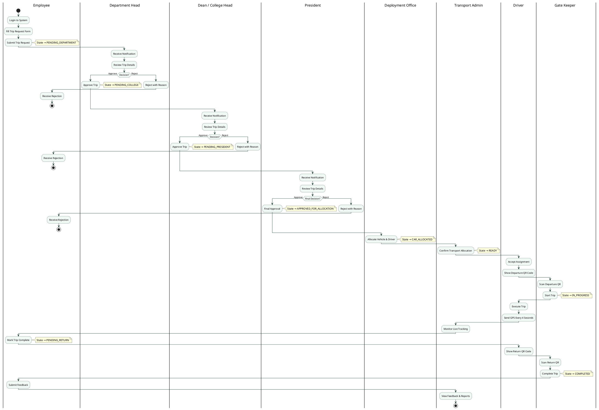
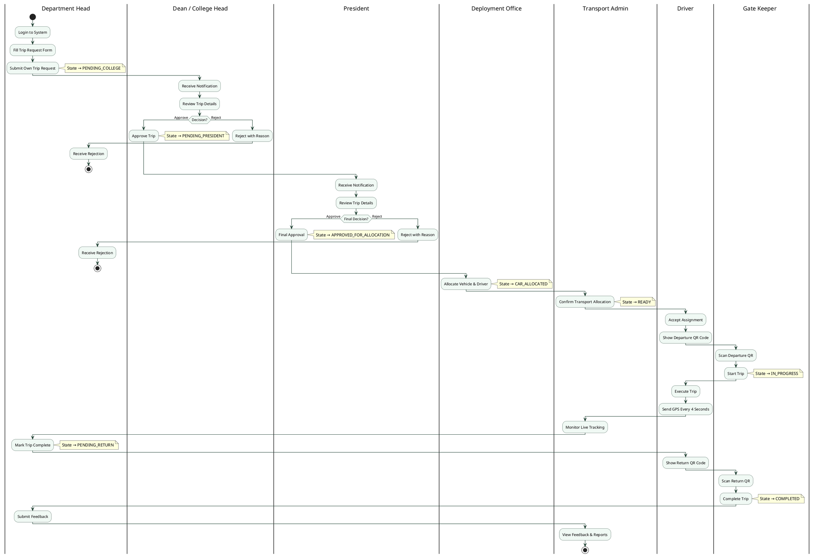
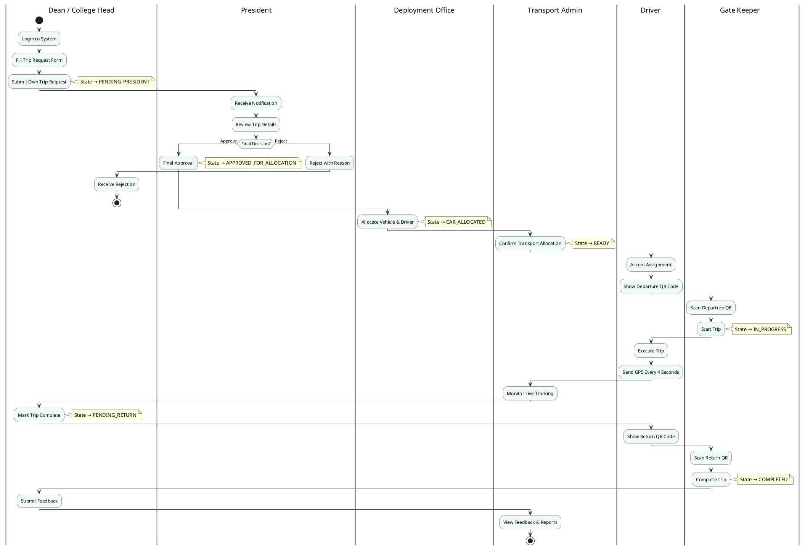
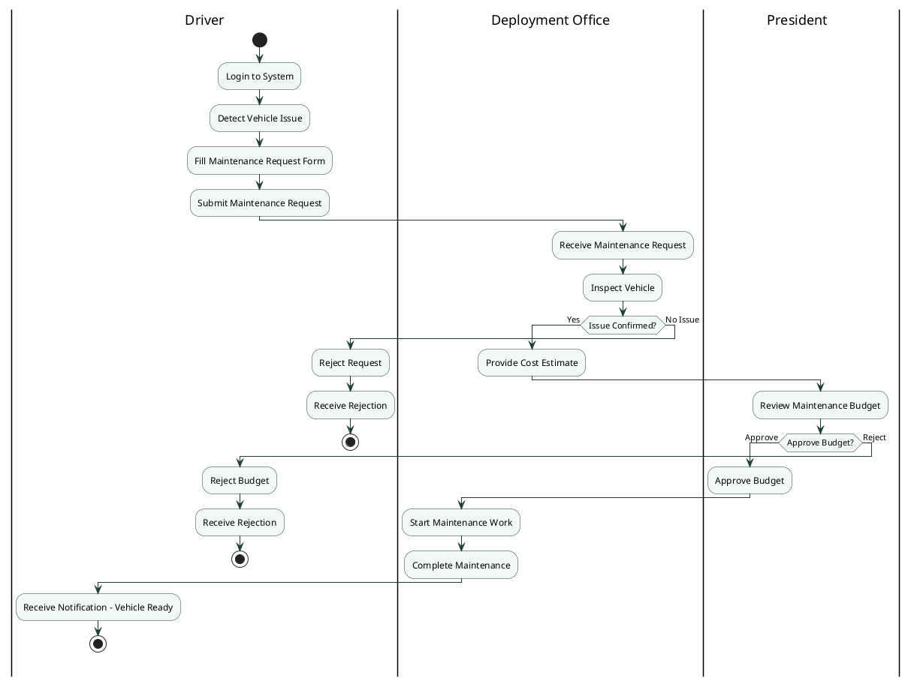

# Fleet Management System — Activity Diagrams

---

## Diagram 1 — Employee Trip Request (Full Flow)

---

## Diagram 2 — Department Head Trip Request (Full Flow)

---

## Diagram 3 — Dean / College Head Trip Request (Full Flow)

---

## Diagram 4 — Driver Maintenance Request (Full Flow)

---

## Approval Path Summary

| Requester | Approval Path |
|---|---|
| Employee | Dept Head → Dean → President → Allocation |
| Department Head | Dean → President → Allocation |
| Dean / College Head | President → Allocation |
| Driver (Maintenance) | Deployment Office → President |
