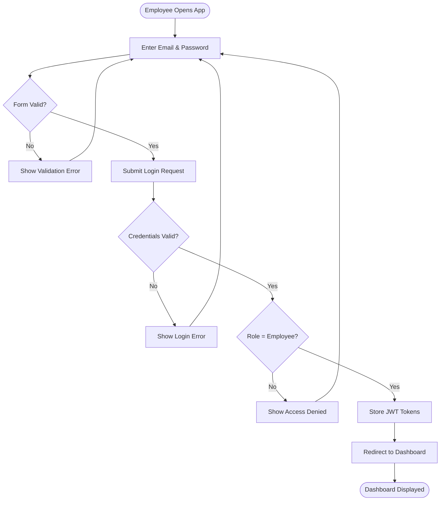
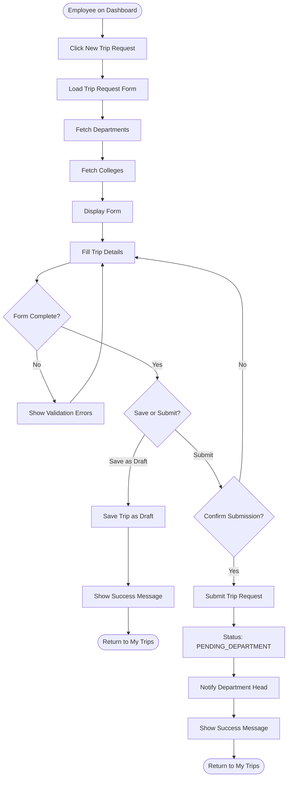
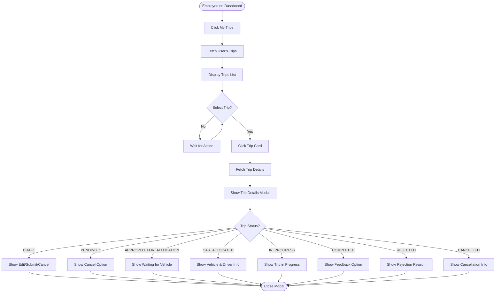
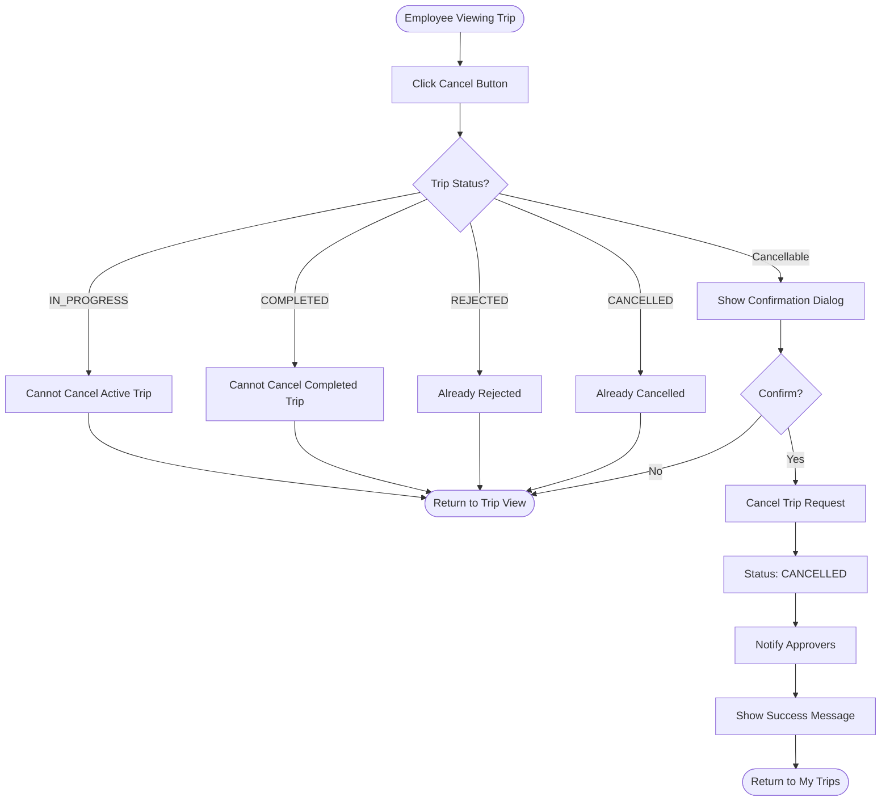
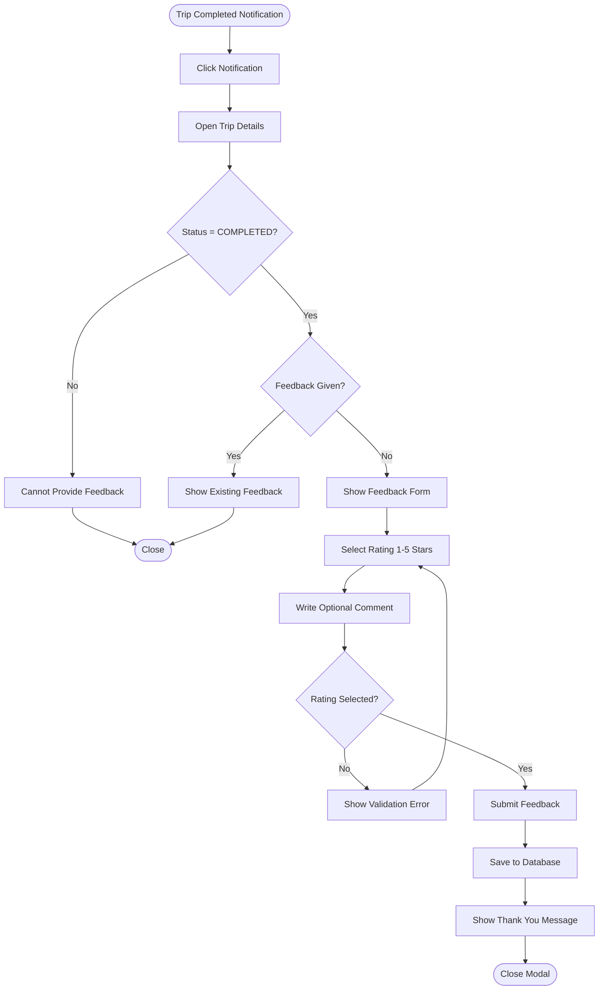
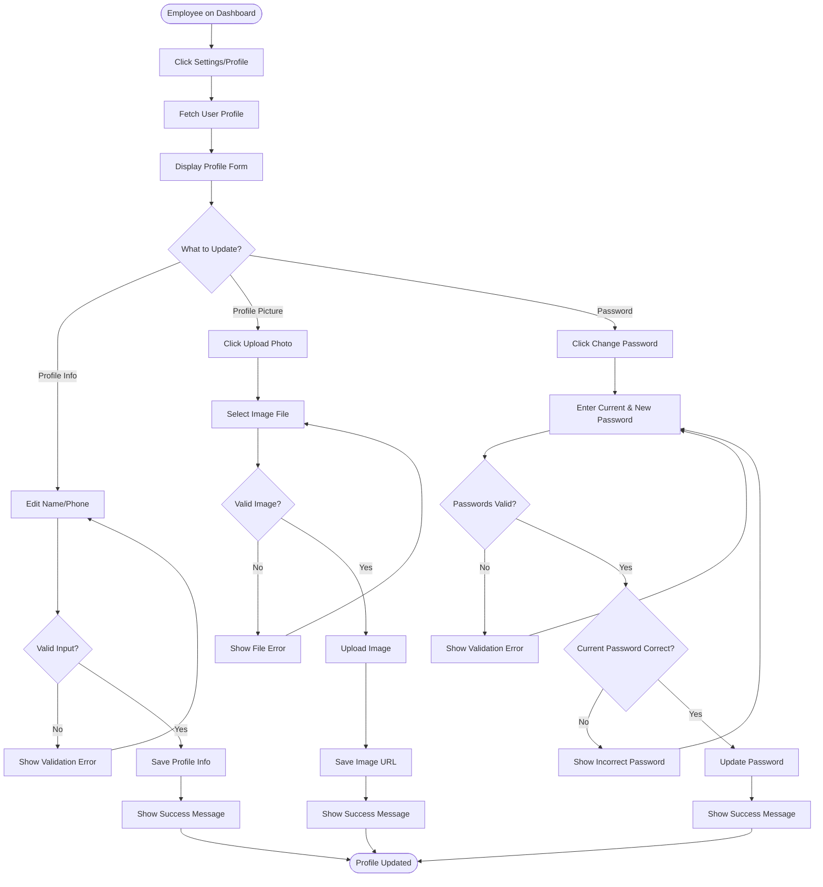
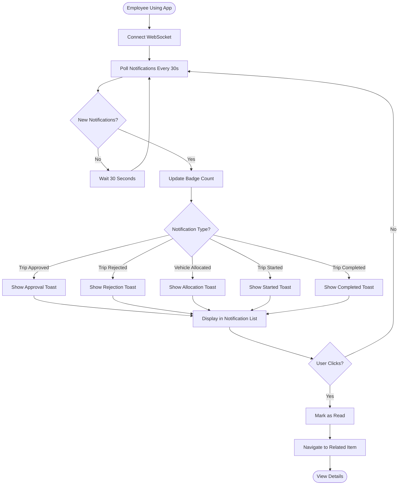
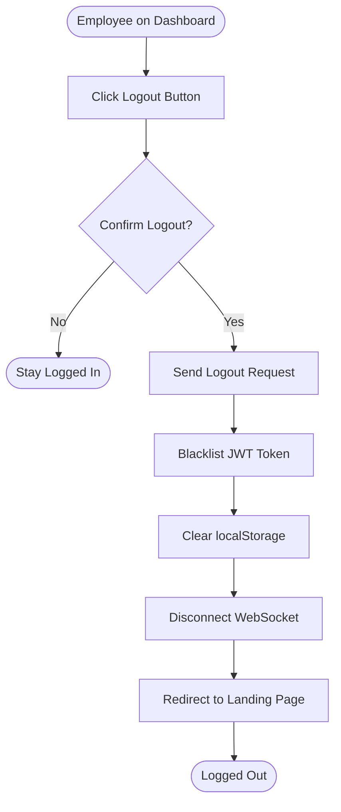

# Employee App - Activity Diagrams

## Actor: Employee (University Staff/Faculty)

---

## 1. Employee Login Flow

---

## 2. Create and Submit Trip Request Flow

---

## 3. View Trip Status Flow

---

## 4. Cancel Trip Request Flow

---

## 5. Provide Trip Feedback Flow

---

## 6. Update Profile Flow

---

## 7. View Notifications Flow

---

## 8. Logout Flow

---

## Summary

### Employee App Activity Flows:
1. ✅ Login with authentication and role verification
2. ✅ Create and submit trip requests with draft option
3. ✅ View trip status with different states
4. ✅ Cancel trips with status validation
5. ✅ Provide feedback for completed trips
6. ✅ Update profile (info, picture, password)
7. ✅ Receive and view real-time notifications
8. ✅ Logout with token blacklisting

### Key Decision Points:
- **Form validation** before submission
- **Status checks** before actions (cancel, feedback)
- **Role verification** during login
- **Confirmation dialogs** for critical actions
- **Real-time updates** via WebSocket and polling

### Trip Status Flow:
DRAFT → PENDING_DEPARTMENT → PENDING_COLLEGE → PENDING_PRESIDENT → APPROVED_FOR_ALLOCATION → CAR_ALLOCATED → IN_PROGRESS → COMPLETED
