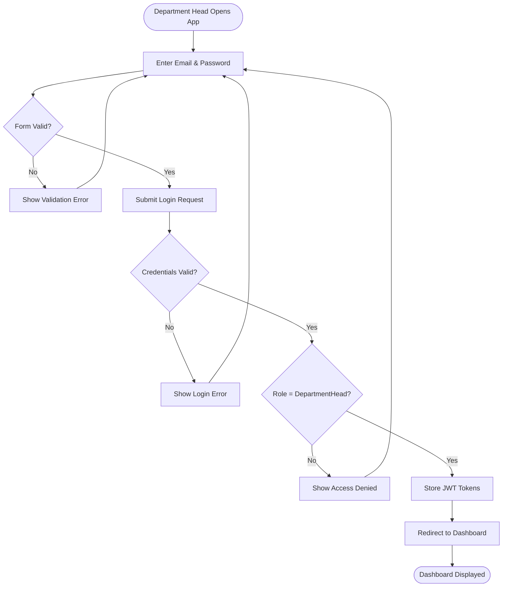
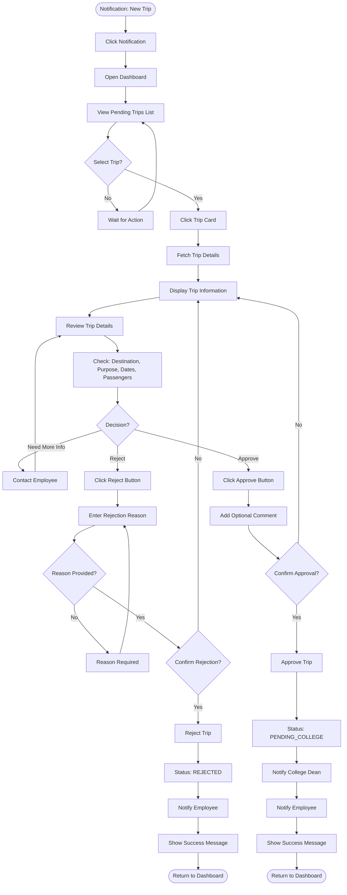
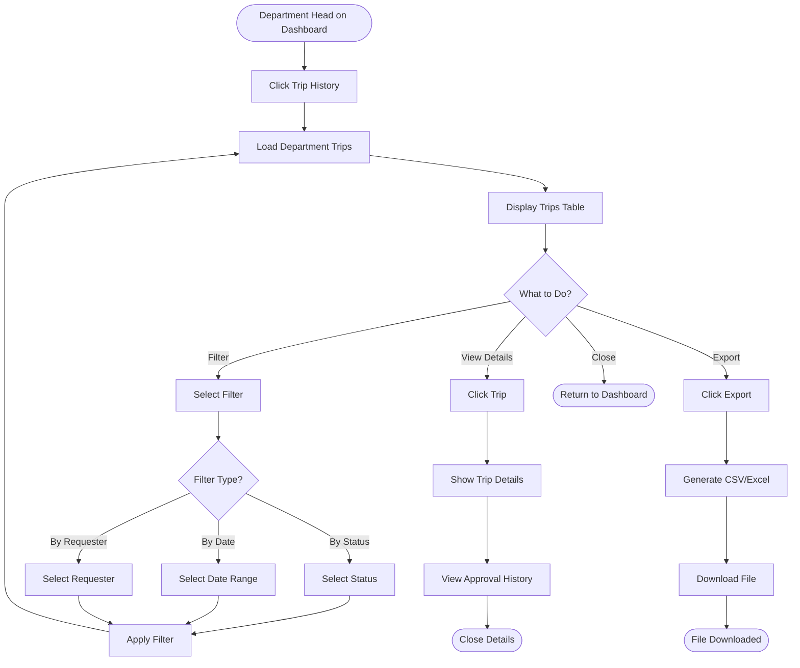
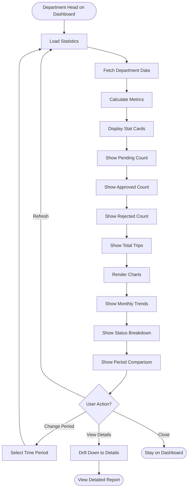
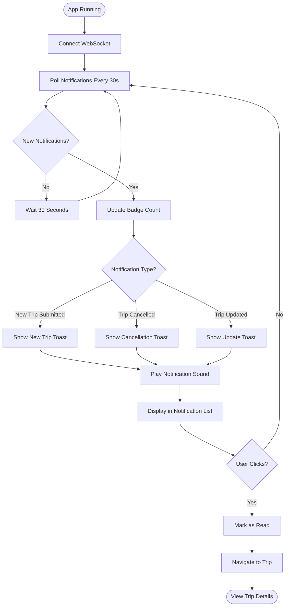
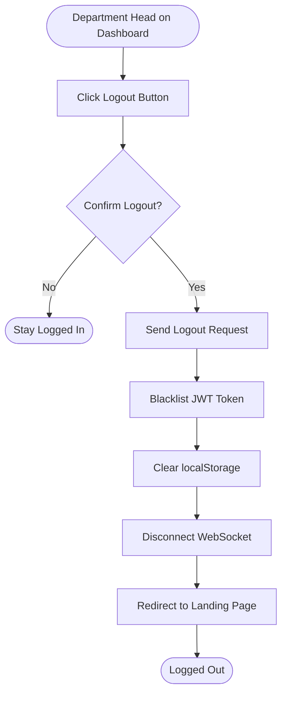

# Department Head App - Activity Diagrams

## Actor: Department Head (Faculty Department Leader)

---

## 1. Department Head Login Flow

---

## 2. Review and Approve Trip Request Flow

---

## 3. View Department Trip History Flow

---

## 4. View Department Statistics Flow

---

## 5. Manage Notifications Flow

---

## 6. Logout Flow

---

## Summary

### Department Head App Activity Flows:
1. ✅ Login with role verification
2. ✅ Review and approve/reject trip requests
3. ✅ View department trip history with filters
4. ✅ View department statistics and trends
5. ✅ Manage real-time notifications
6. ✅ Logout with token cleanup

### Key Decision Points:
- **Trip approval decision** (approve/reject/need more info)
- **Rejection reason** validation (required)
- **Confirmation dialogs** for critical actions
- **Filter selection** for trip history
- **Real-time notifications** for new submissions

### Approval Responsibility:
- **First-level approval** for department trips
- **Review trip details** before decision
- **Provide rejection reasons** when declining
- **Monitor department activity** through statistics
- **Respond to notifications** promptly

### Trip Flow Impact:
Employee submits → **PENDING_DEPARTMENT** → Department Head approves → **PENDING_COLLEGE** → College Dean reviews
