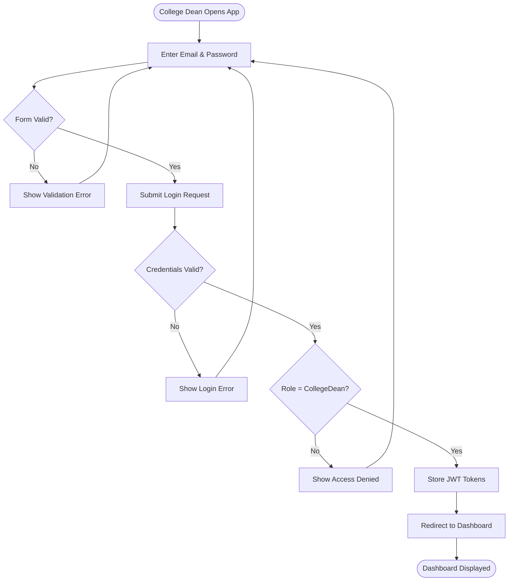
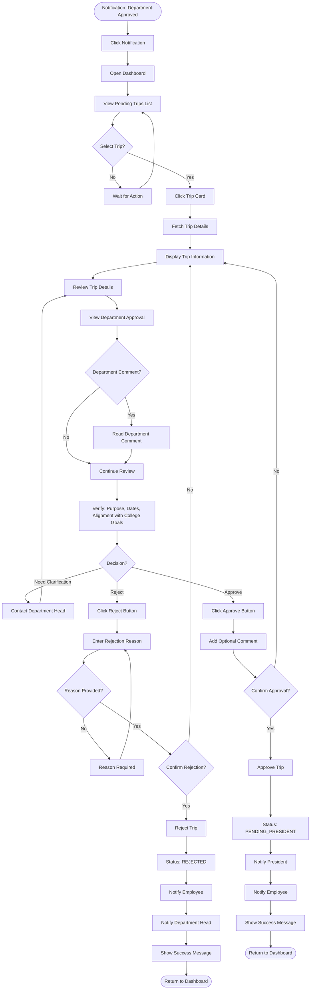
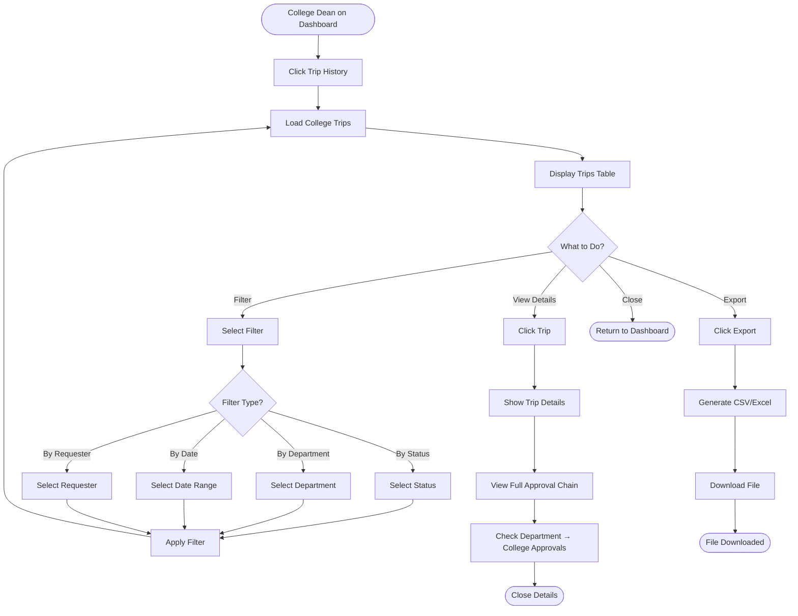
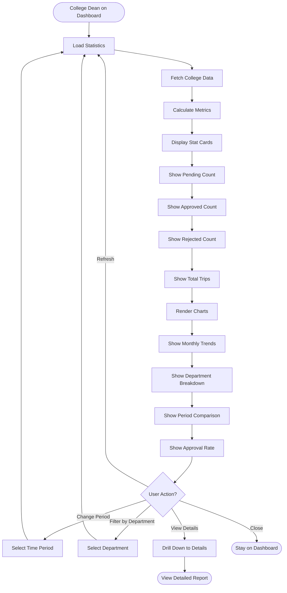
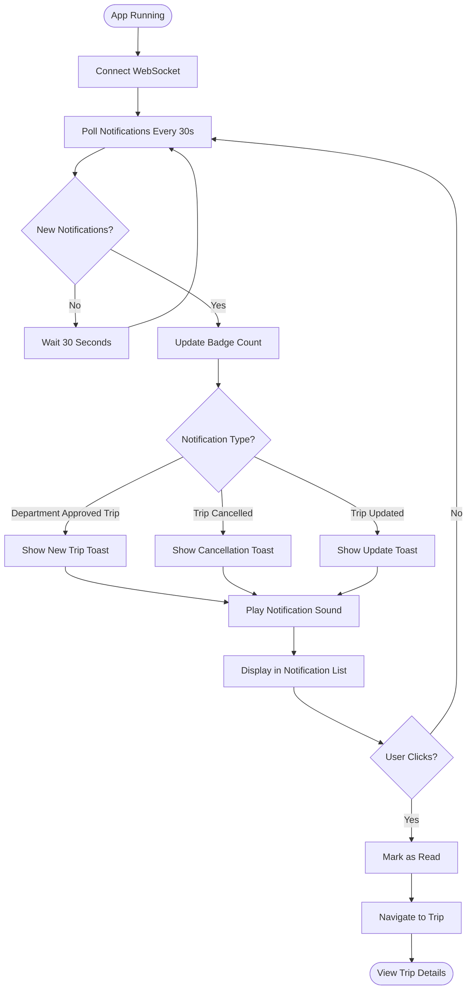
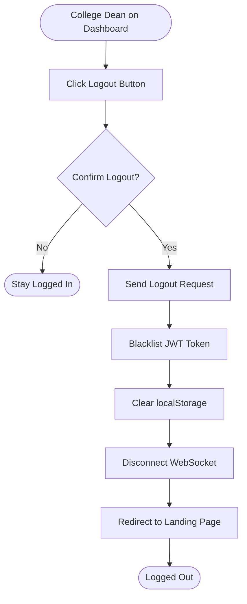

# College Dean App - Activity Diagrams

## Actor: College Dean (College Administrator)

---

## 1. College Dean Login Flow

---

## 2. Review Trip with Department Approval Flow

---

## 3. View College Trip History Flow

---

## 4. View College Statistics Flow

---

## 5. Manage Notifications Flow

---

## 6. Logout Flow

---

## Summary

### College Dean App Activity Flows:
1. ✅ Login with role verification
2. ✅ Review trips with department approval history
3. ✅ Approve/reject trips with comments
4. ✅ View college trip history with department filters
5. ✅ View college statistics by department
6. ✅ Manage real-time notifications
7. ✅ Logout with token cleanup

### Key Decision Points:
- **Review department approval** before making decision
- **Trip approval decision** (approve/reject/need clarification)
- **Rejection reason** validation (required)
- **Department filter** for college-wide view
- **Confirmation dialogs** for critical actions

### Approval Responsibility:
- **Second-level approval** for college trips
- **Review department approval** and comments
- **Verify alignment** with college goals
- **Monitor college-wide activity** across departments
- **Coordinate with department heads** when needed

### Trip Flow Impact:
Department Head approves → **PENDING_COLLEGE** → College Dean approves → **PENDING_PRESIDENT** → President reviews
