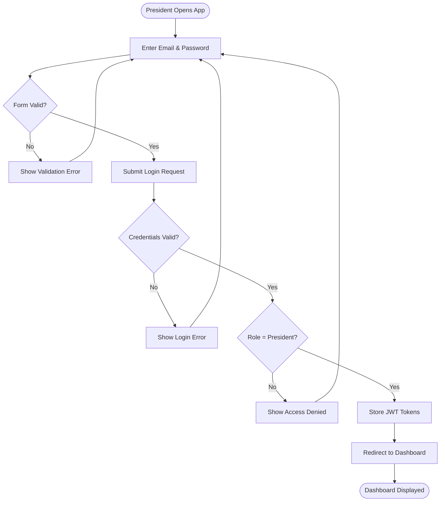
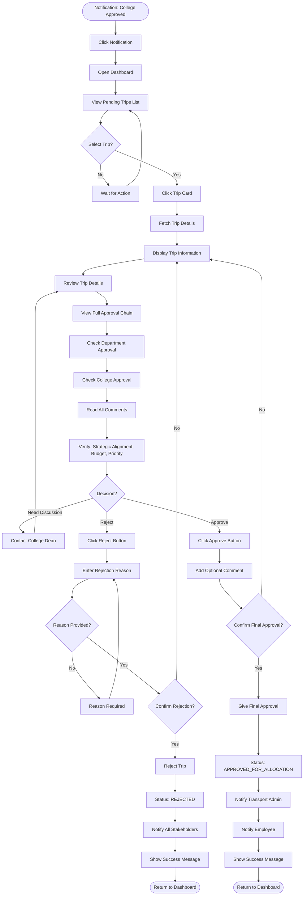
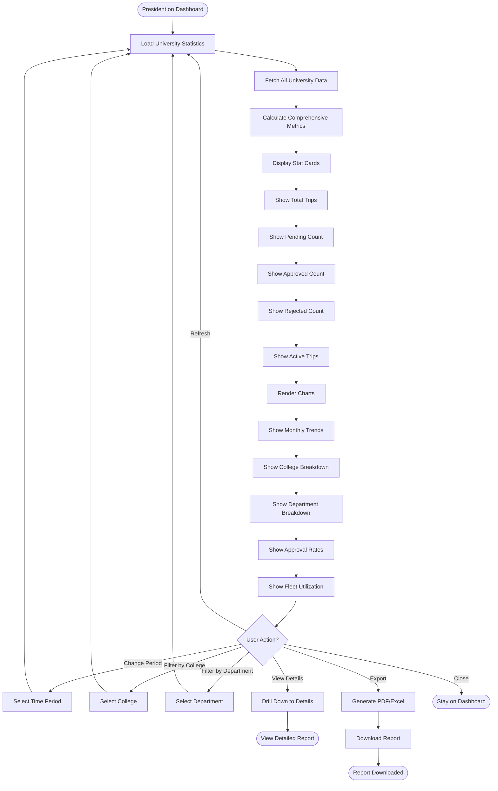
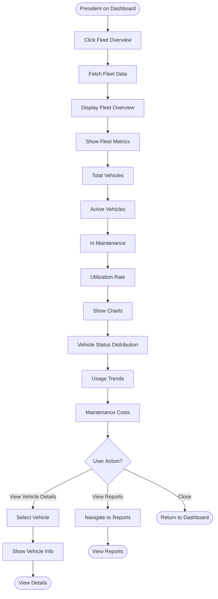
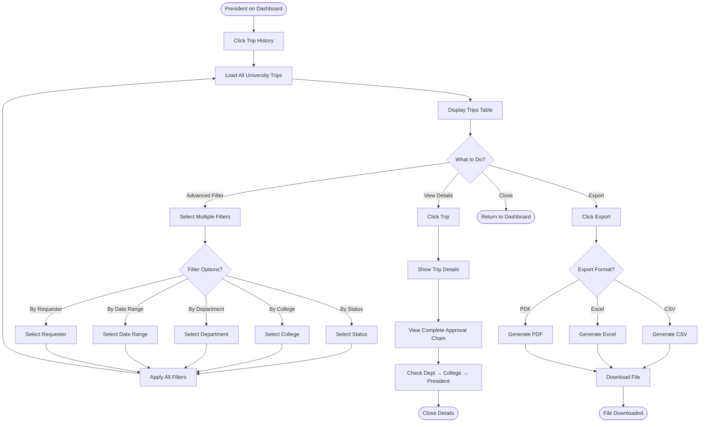
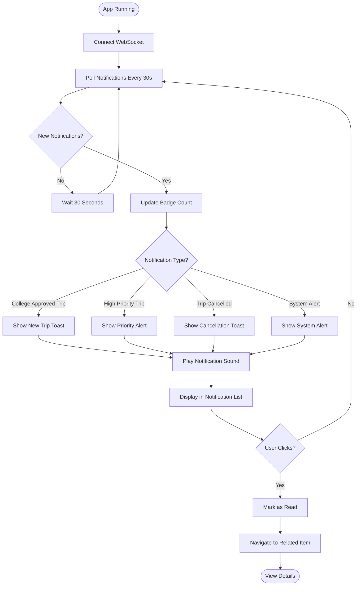
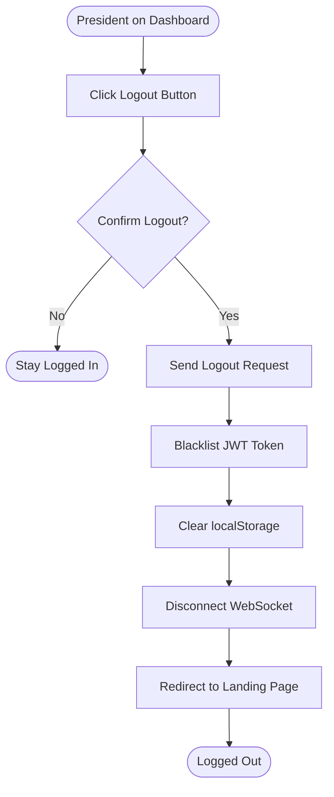

# President App - Activity Diagrams

## Actor: President (University President)

---

## 1. President Login Flow

---

## 2. Final Approval of Trip Request Flow

---

## 3. View University-Wide Statistics Flow

---

## 4. View Fleet Overview Flow

---

## 5. View University-Wide Trip History Flow

---

## 6. Manage Notifications Flow

---

## 7. Logout Flow

---

## Summary

### President App Activity Flows:
1. ✅ Login with highest-level role verification
2. ✅ Final approval with full approval chain review
3. ✅ View university-wide statistics
4. ✅ View fleet overview and utilization
5. ✅ View all university trips with advanced filters
6. ✅ Manage high-priority notifications
7. ✅ Logout with token cleanup

### Key Decision Points:
- **Review complete approval chain** (Dept → College → President)
- **Strategic alignment** verification
- **Budget and priority** considerations
- **Final approval decision** (approve/reject/discuss)
- **University-wide oversight** across all colleges

### Approval Responsibility:
- **Final approval authority** for all trips
- **Strategic decision-making** for university resources
- **Review all previous approvals** and comments
- **Monitor university-wide** trip activity
- **Ensure alignment** with institutional goals

### Trip Flow Impact:
College Dean approves → **PENDING_PRESIDENT** → President approves → **APPROVED_FOR_ALLOCATION** → Transport Admin allocates resources
