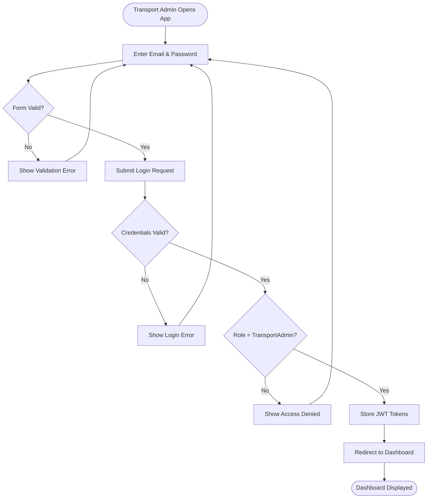
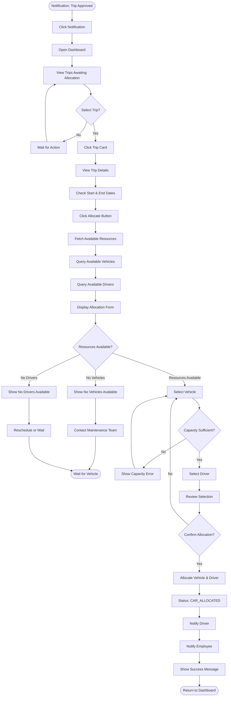
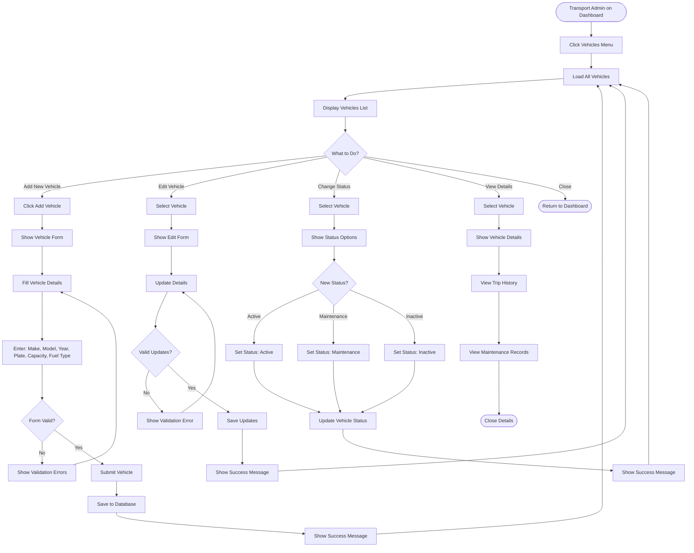
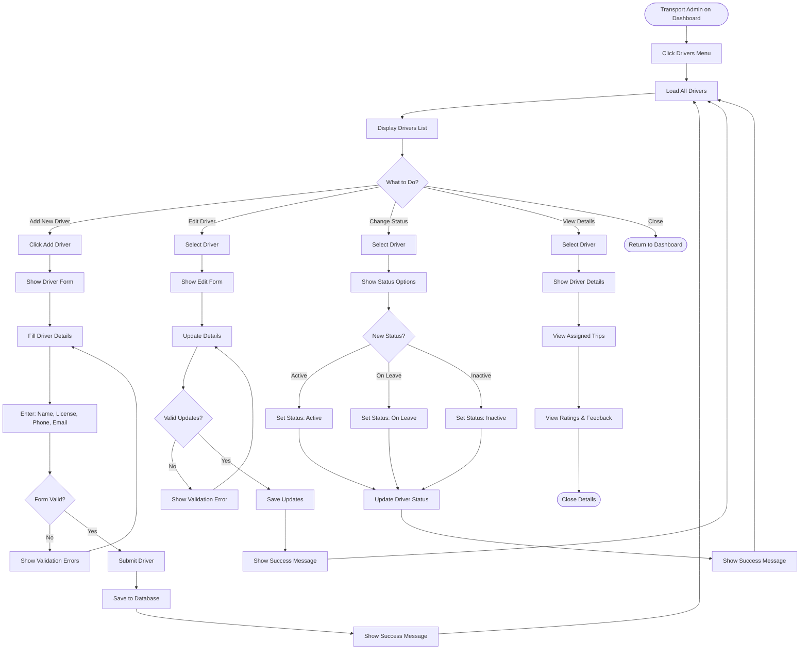
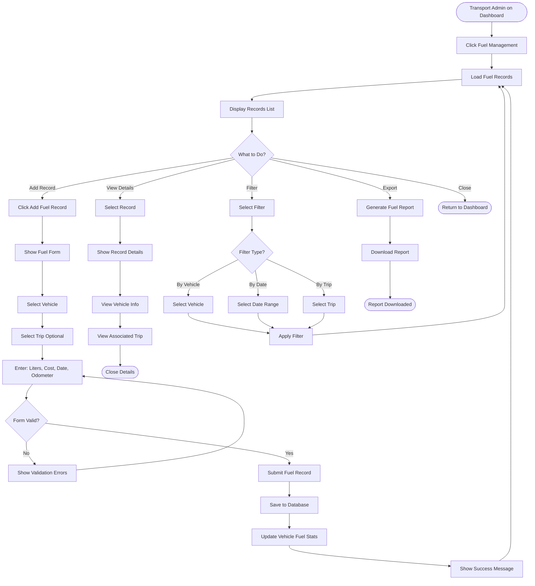
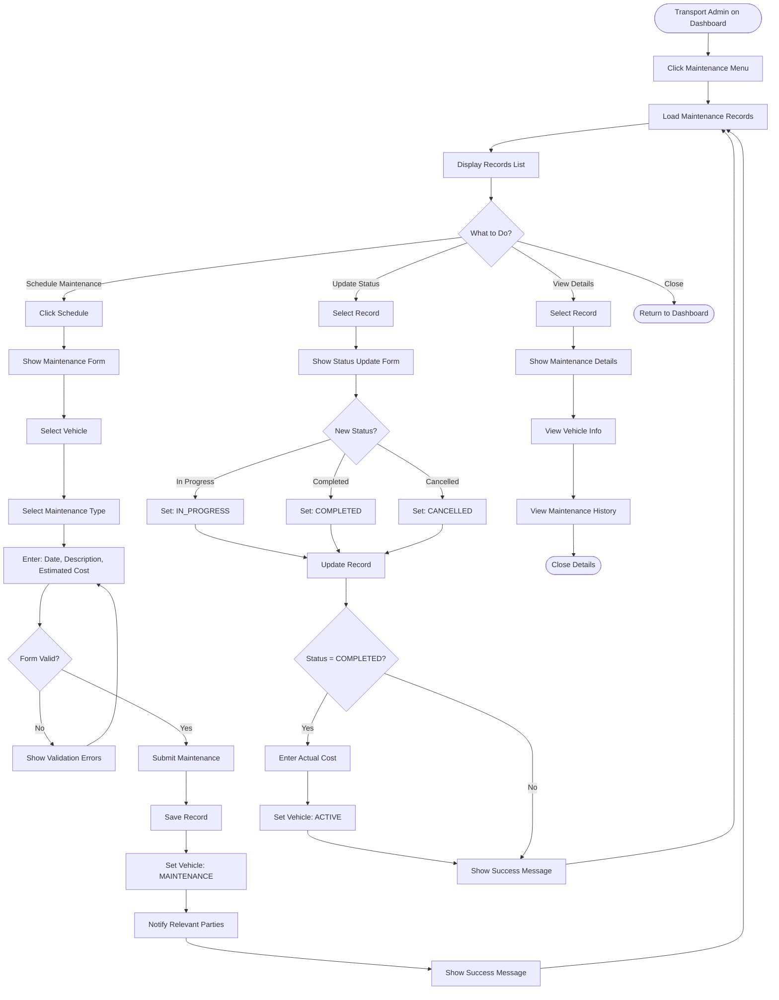
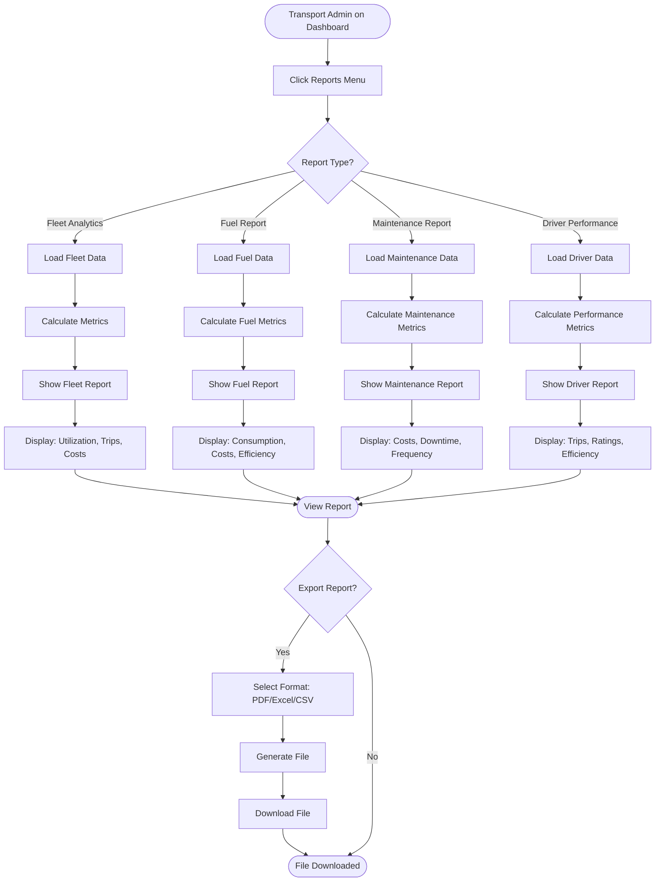
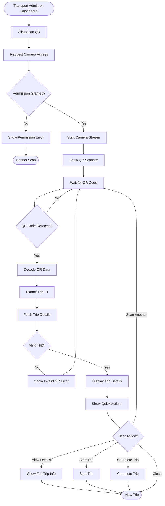
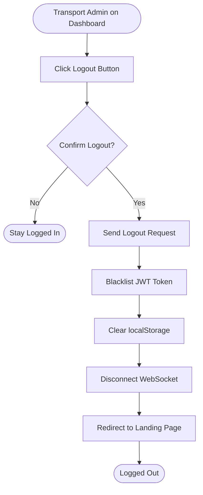

# Transport Admin App - Activity Diagrams

## Actor: Transport Admin (Fleet Manager)

---

## 1. Transport Admin Login Flow

---

## 2. Allocate Vehicle and Driver to Approved Trip Flow

---

## 3. Manage Vehicles Flow

---

## 4. Manage Drivers Flow

---

## 5. Manage Fuel Records Flow

---

## 6. Manage Maintenance Flow

---

## 7. View Reports and Analytics Flow

---

## 8. QR Code Scanning Flow

---

## 9. Logout Flow

---

## Summary

### Transport Admin App Activity Flows:
1. ✅ Login with role verification
2. ✅ Allocate vehicles and drivers to approved trips
3. ✅ Manage vehicles (CRUD operations)
4. ✅ Manage drivers (CRUD operations)
5. ✅ Manage fuel records
6. ✅ Manage maintenance schedules
7. ✅ View comprehensive reports and analytics
8. ✅ QR code scanning for quick access
9. ✅ Logout with token cleanup

### Key Decision Points:
- **Resource availability** check before allocation
- **Vehicle capacity** verification
- **Driver availability** confirmation
- **Maintenance status** updates
- **Form validation** for all data entry

### Resource Management Responsibilities:
- **Allocate resources** to approved trips
- **Maintain fleet** vehicles and drivers
- **Track fuel consumption** and costs
- **Schedule maintenance** proactively
- **Generate reports** for operational insights
- **Monitor utilization** and efficiency

### Trip Flow Impact:
President approves → **APPROVED_FOR_ALLOCATION** → Transport Admin allocates → **CAR_ALLOCATED** → Driver starts → **IN_PROGRESS**
