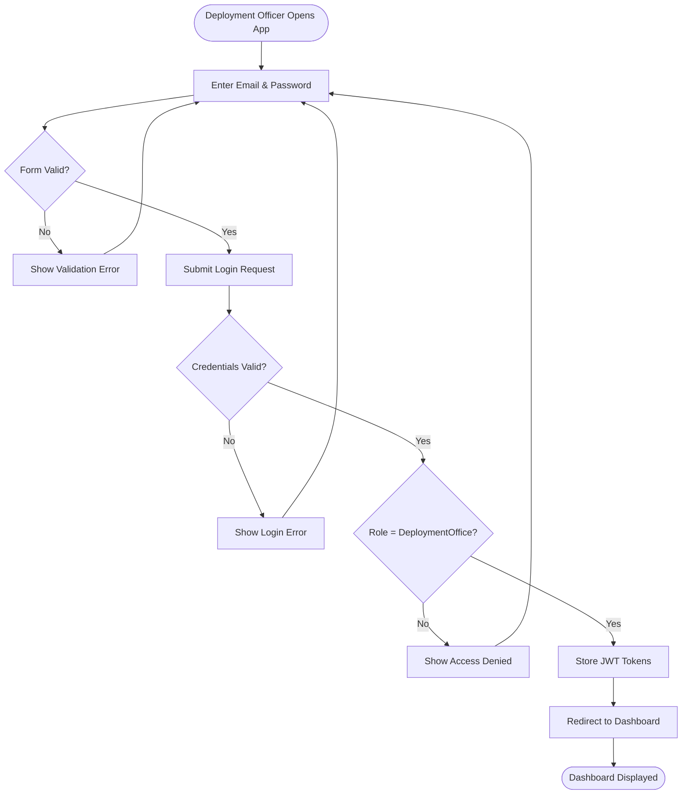
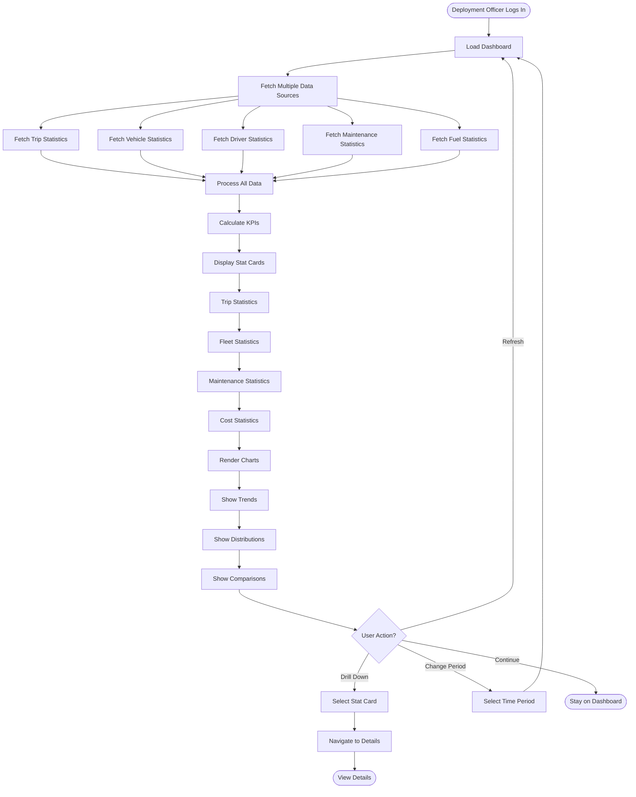
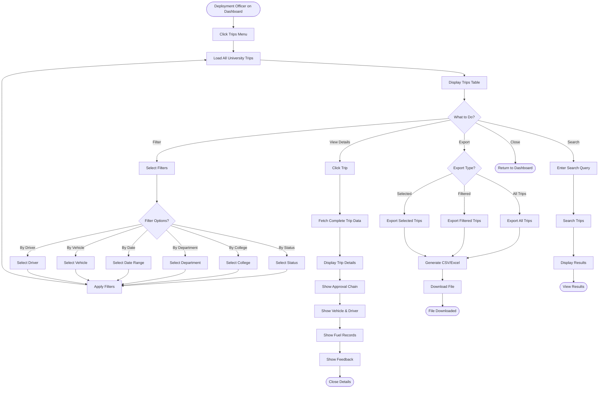
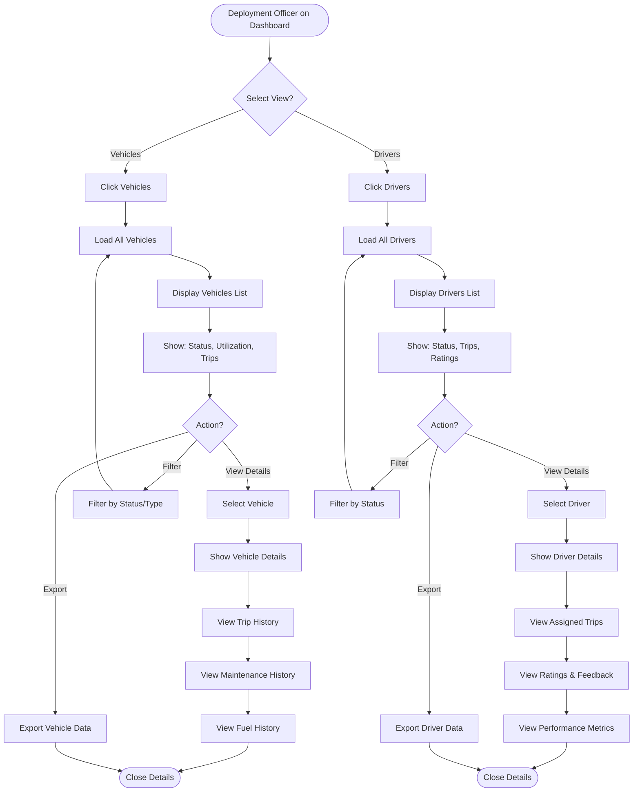
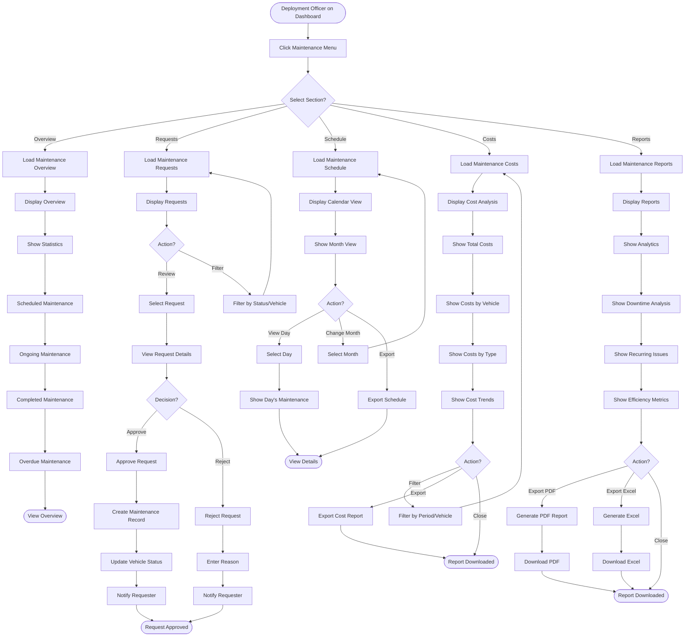
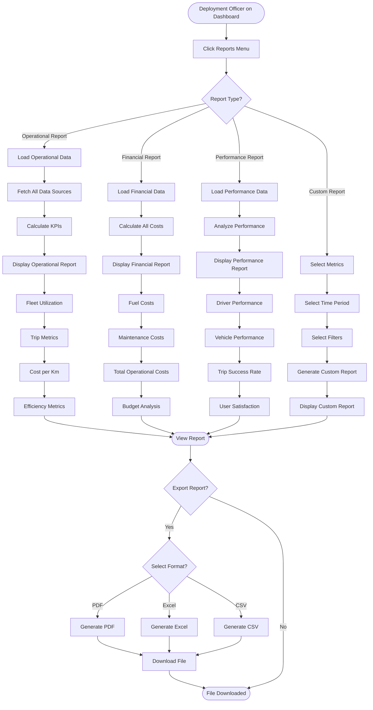
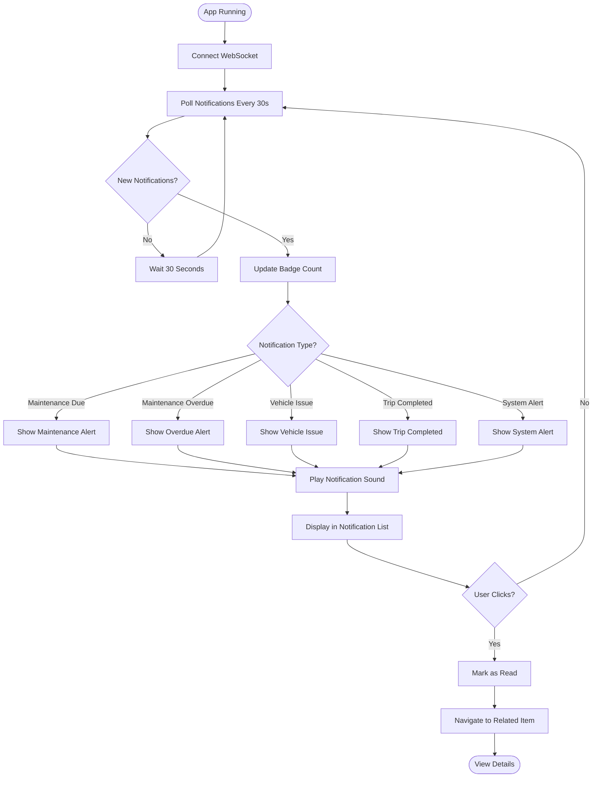
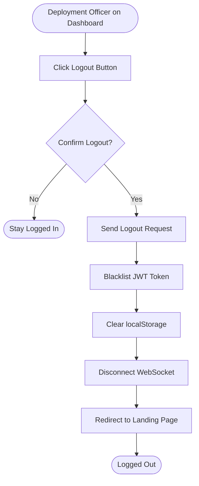

# Deployment Office App - Activity Diagrams

## Actor: Deployment Office (Operations Manager)

---

## 1. Deployment Office Login Flow

---

## 2. View Comprehensive Dashboard Flow

---

## 3. Monitor All Trips Flow

---

## 4. Monitor Fleet Operations Flow

---

## 5. Maintenance Management Flow

---

## 6. Generate Comprehensive Reports Flow

---

## 7. Manage Notifications Flow

---

## 8. Logout Flow

---

## Summary

### Deployment Office App Activity Flows:
1. ✅ Login with role verification
2. ✅ View comprehensive dashboard with all KPIs
3. ✅ Monitor all university trips
4. ✅ Monitor fleet operations (vehicles & drivers)
5. ✅ Manage maintenance (overview, requests, schedule, costs, reports)
6. ✅ Generate comprehensive operational reports
7. ✅ Manage system notifications
8. ✅ Logout with token cleanup

### Key Decision Points:
- **Maintenance request approval** (approve/reject)
- **Report type selection** (operational/financial/performance/custom)
- **Filter and export options** for all data views
- **Multi-source data aggregation** for dashboard
- **Drill-down navigation** for detailed analysis

### Operational Oversight Responsibilities:
- **Monitor all operations** across the university
- **Approve maintenance requests** and manage schedules
- **Track costs** (fuel, maintenance, operational)
- **Generate reports** for decision-making
- **Analyze performance** and efficiency metrics
- **Ensure fleet availability** and readiness
- **Oversee resource utilization** university-wide

### Read-Only Access with Maintenance Authority:
- **View all trips** (cannot modify)
- **View all vehicles and drivers** (cannot modify)
- **Approve/reject maintenance requests** (authority)
- **Generate and export reports** (full access)
- **Monitor real-time operations** (full visibility)
