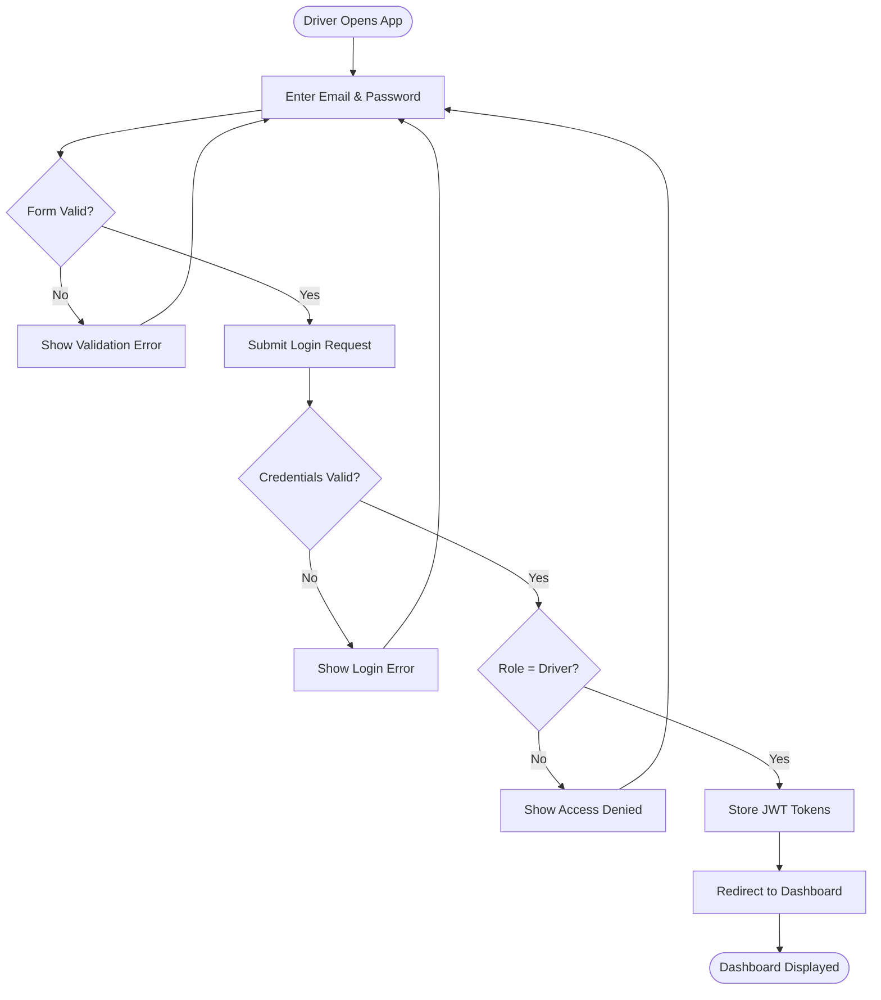
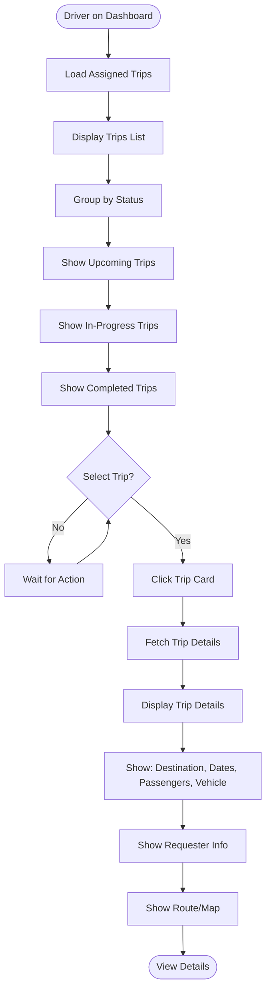
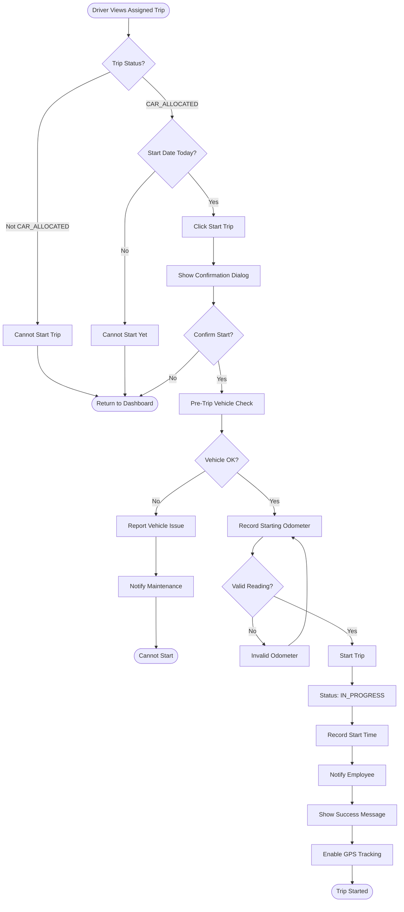
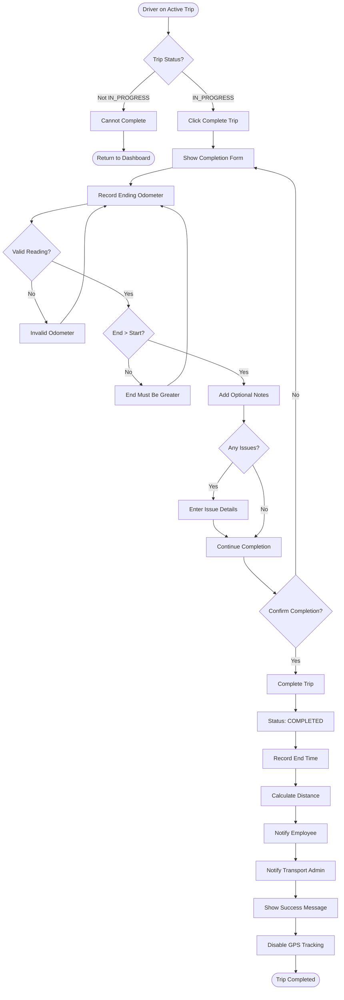
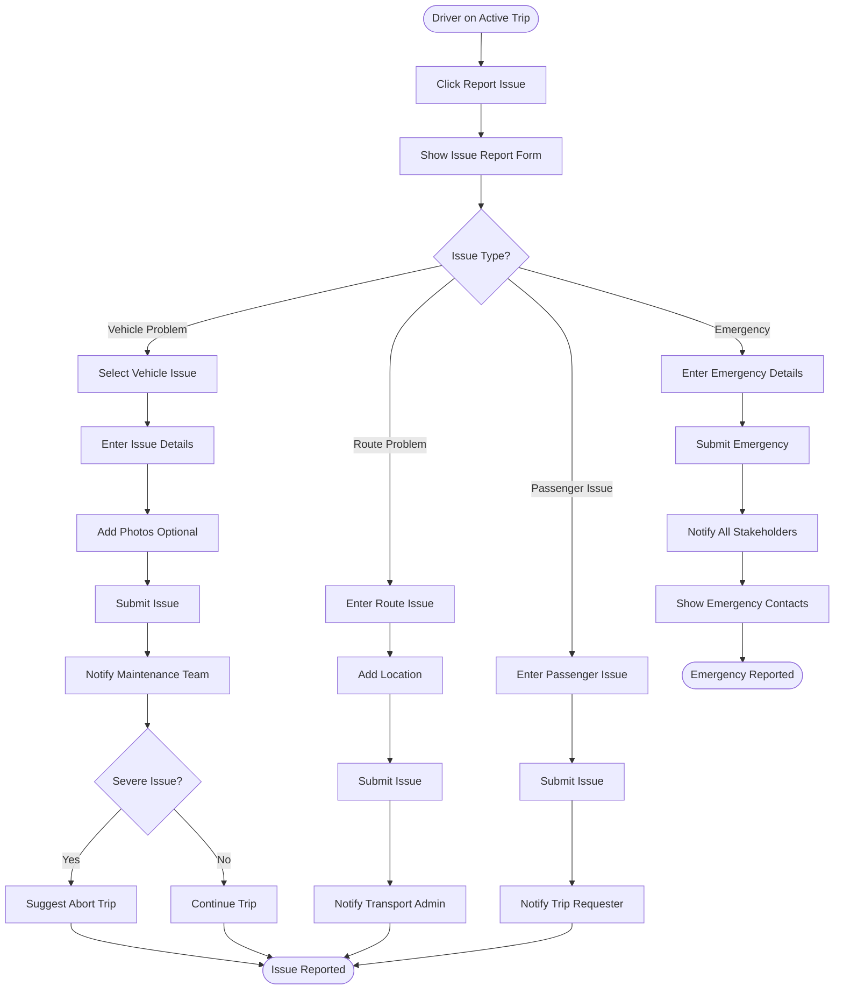
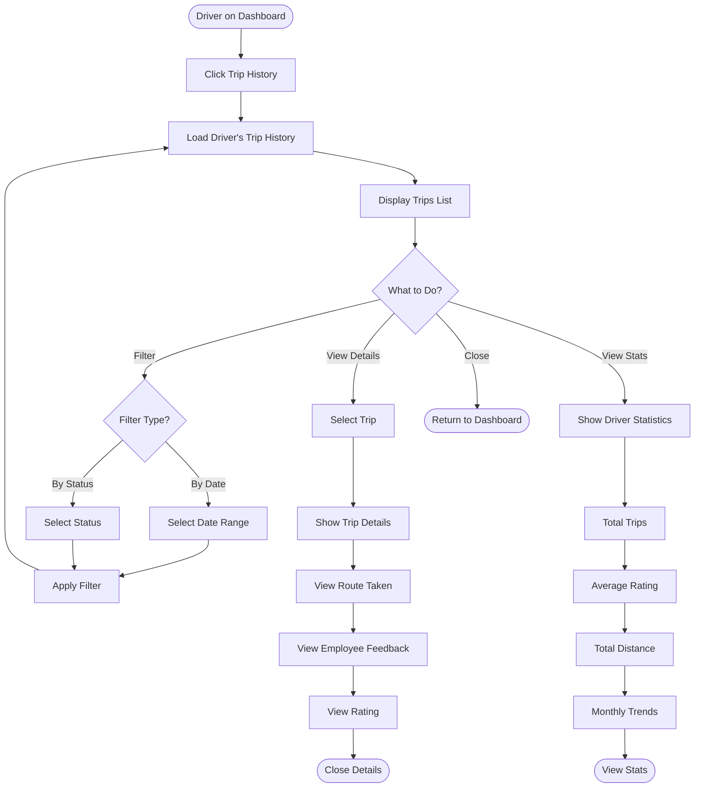
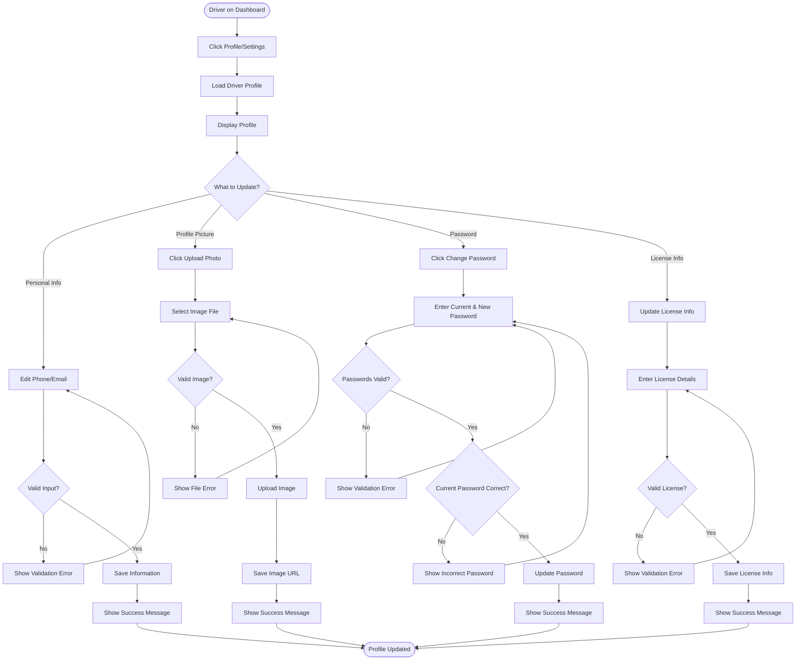
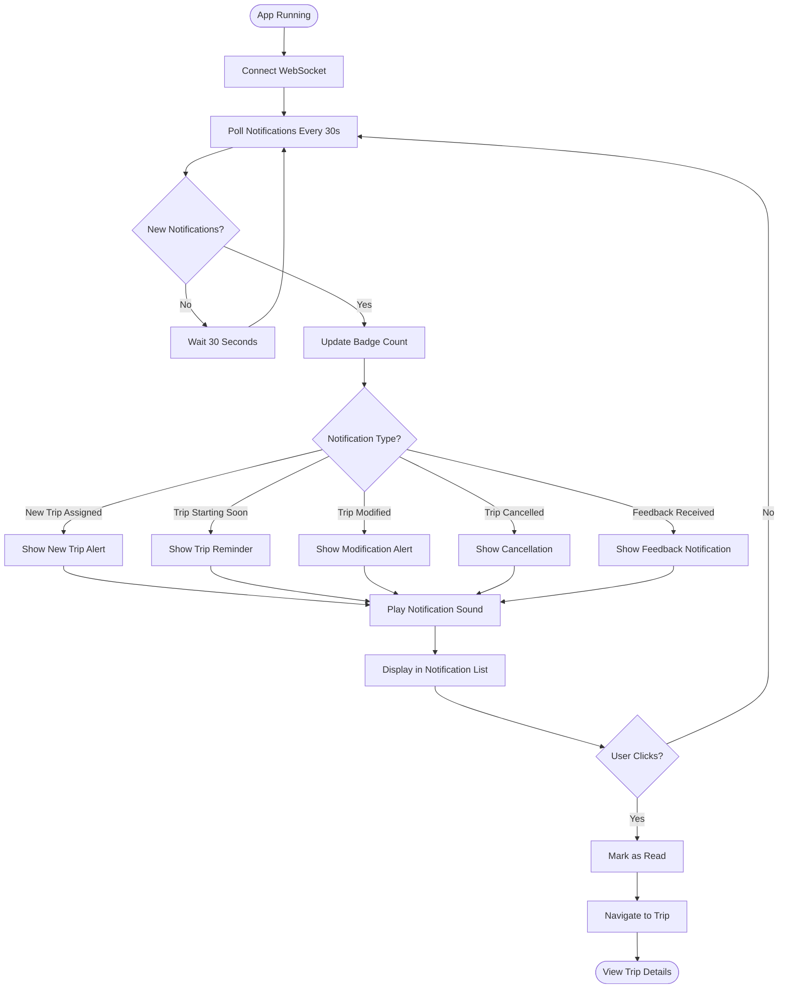
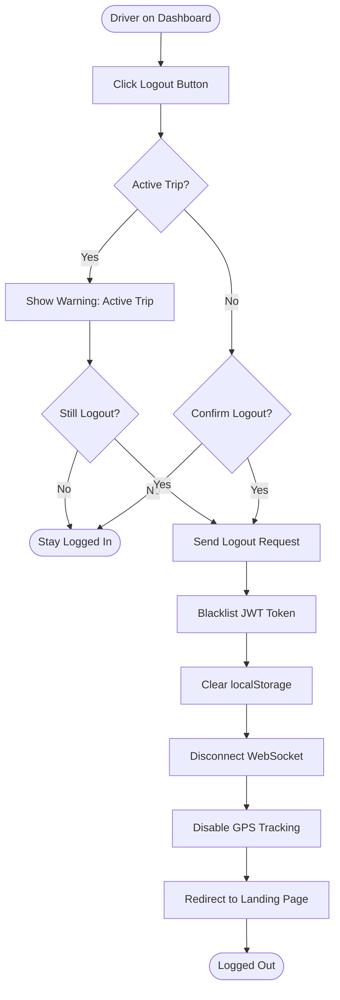

# Driver App - Activity Diagrams

## Actor: Driver (Vehicle Operator)

---

## 1. Driver Login Flow

---

## 2. View Assigned Trips Flow

---

## 3. Start Trip Flow

---

## 4. Complete Trip Flow

---

## 5. Report Issue During Trip Flow

---

## 6. View Trip History Flow

---

## 7. Update Profile Flow

---

## 8. Manage Notifications Flow

---

## 9. Logout Flow

---

## Summary

### Driver App Activity Flows:
1. ✅ Login with role verification
2. ✅ View assigned trips (upcoming, in-progress, completed)
3. ✅ Start trip with vehicle check and odometer reading
4. ✅ Complete trip with odometer and notes
5. ✅ Report issues during trip (vehicle, route, passenger, emergency)
6. ✅ View trip history and statistics
7. ✅ Update profile (info, picture, password, license)
8. ✅ Manage real-time notifications
9. ✅ Logout with active trip warning

### Key Decision Points:
- **Trip status validation** before start/complete
- **Vehicle condition check** before starting
- **Odometer validation** (end > start)
- **Issue severity assessment** for reporting
- **Active trip warning** before logout

### Driver Responsibilities:
- **Accept assigned trips** from transport admin
- **Perform pre-trip checks** on vehicle
- **Start and complete trips** with accurate records
- **Report issues** promptly during trips
- **Maintain vehicle** in good condition
- **Provide safe transportation** for passengers
- **Record accurate odometer** readings

### Trip Flow Impact:
Transport Admin allocates → **CAR_ALLOCATED** → Driver starts → **IN_PROGRESS** → Driver completes → **COMPLETED** → Employee provides feedback
