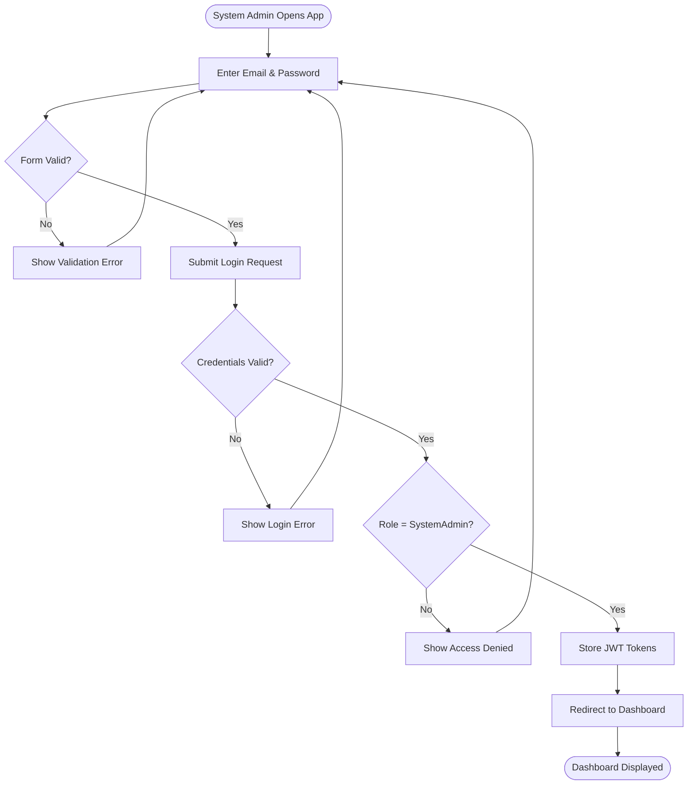
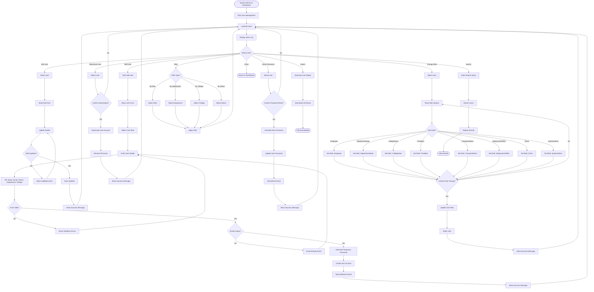
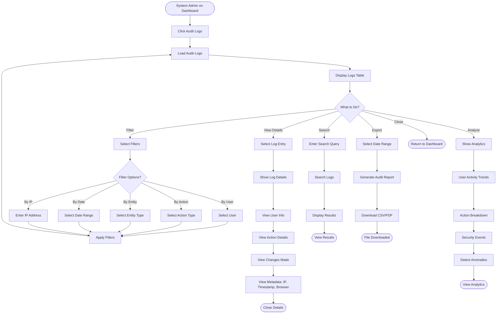
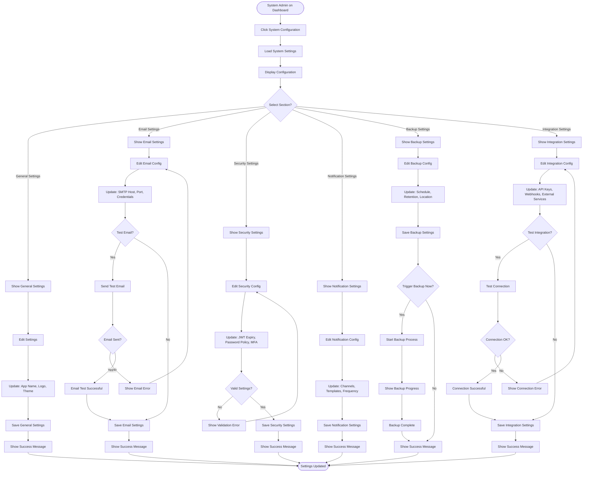
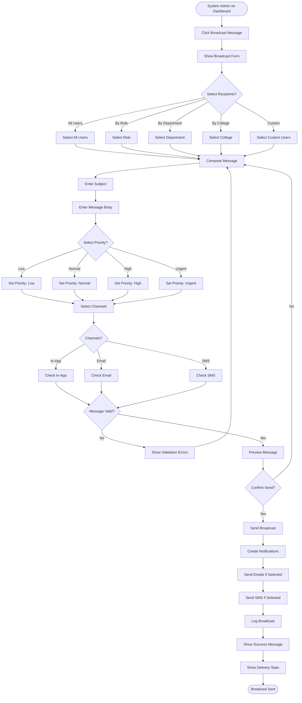
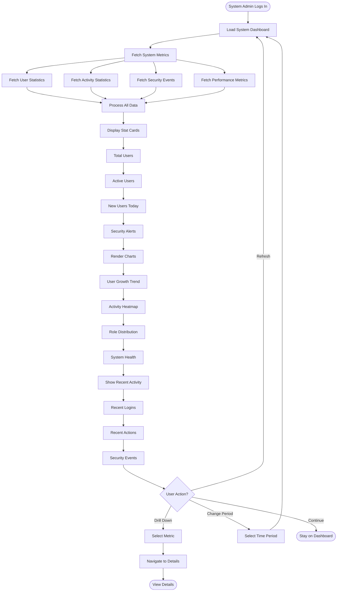
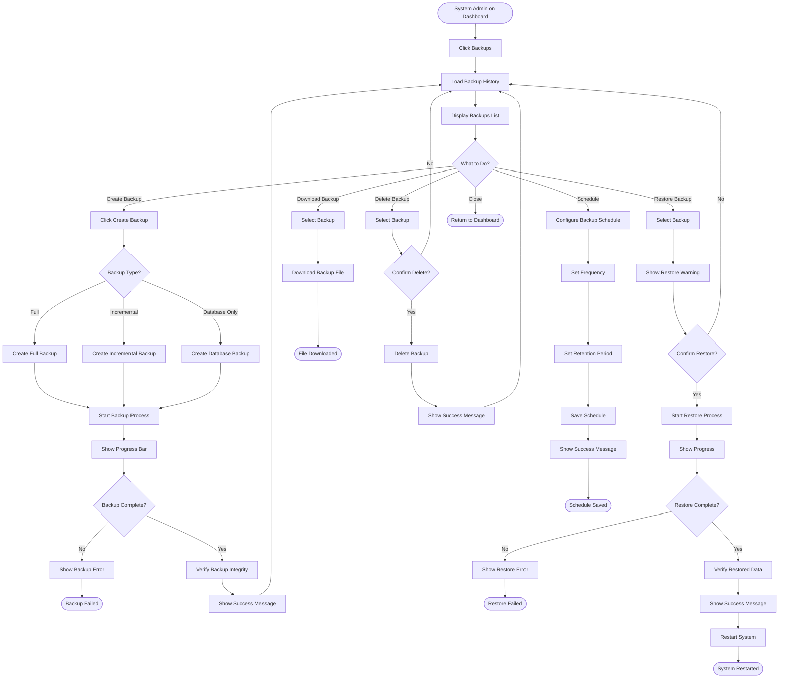
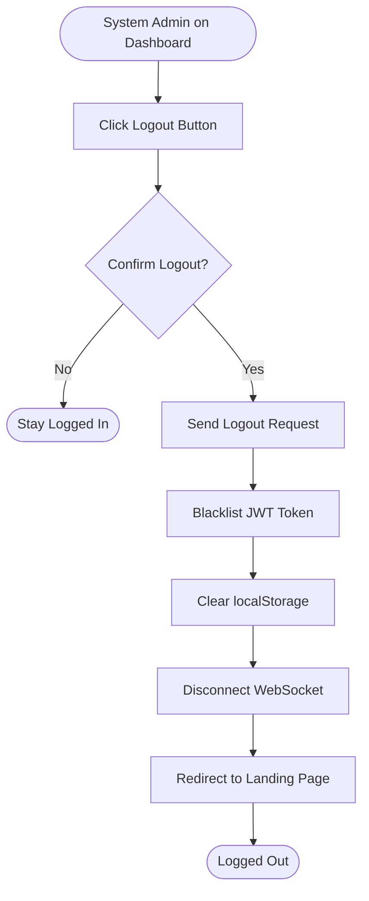

# System Admin App - Activity Diagrams

## Actor: System Admin (System Administrator)

---

## 1. System Admin Login Flow

---

## 2. User Management Flow

---

## 3. View Audit Logs Flow

---

## 4. System Configuration Flow

---

## 5. Broadcast Message Flow

---

## 6. View System Dashboard Flow

---

## 7. Manage System Backups Flow

---

## 8. Logout Flow

---

## Summary

### System Admin App Activity Flows:
1. ✅ Login with highest-level system access
2. ✅ Comprehensive user management (CRUD, roles, passwords)
3. ✅ View and analyze audit logs
4. ✅ Configure system settings (general, email, security, notifications, backups, integrations)
5. ✅ Broadcast messages to users
6. ✅ View system dashboard with metrics
7. ✅ Manage system backups (create, restore, download, delete, schedule)
8. ✅ Logout with token cleanup

### Key Decision Points:
- **User role assignment** (8 different roles)
- **Security settings** validation
- **Backup type selection** (full/incremental/database)
- **Restore confirmation** with warning
- **Broadcast recipient selection** (all/role/department/college/custom)
- **Message priority** (low/normal/high/urgent)

### System Administration Responsibilities:
- **Manage all users** across the system
- **Configure system settings** for optimal operation
- **Monitor security** through audit logs
- **Broadcast communications** to users
- **Maintain system backups** for disaster recovery
- **Analyze system metrics** for performance
- **Ensure system security** and compliance
- **Troubleshoot issues** and provide support

### Administrative Authority:
- **Full user management** (create, edit, delete, role changes)
- **System configuration** access
- **Audit log** visibility
- **Backup and restore** capabilities
- **Broadcast messaging** to all users
- **Security settings** control
- **Integration management** authority
