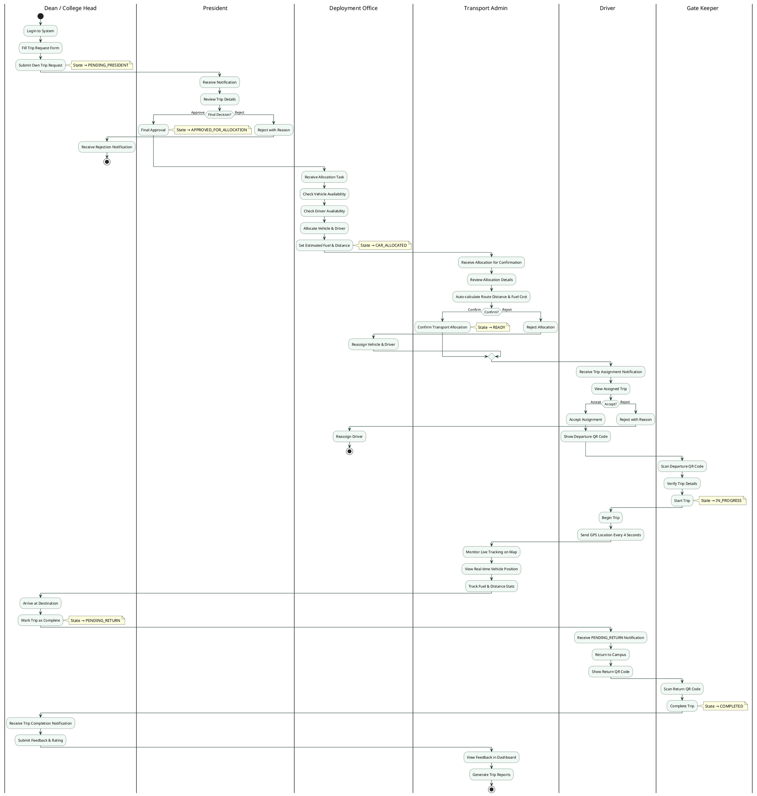

# Activity Diagram — Dean / College Head Trip Request (Full Flow)

**Approval path:** Dean/College Head → President → Deployment Office → Transport Admin → Driver → Gate Keeper → Trip Execution → Completion

