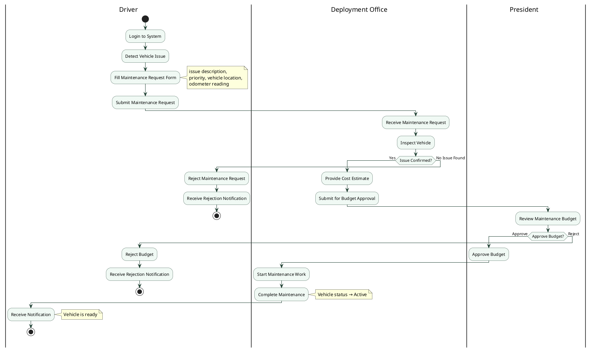

# Activity Diagram — Driver Maintenance Request (Full Flow)

**Flow:** Driver → Deployment Office → President → Deployment Office → Driver

```plantuml
@startuml Driver_Maintenance_Request

skinparam swimlaneWidth 140
skinparam activityBackgroundColor #f0f9f4
skinparam activityBorderColor #1B3D2F
skinparam arrowColor #1B3D2F

|Driver|
start
:Login to System;
:Detect Vehicle Issue;
:Fill Maintenance Request Form;
note right
  issue description,
  priority, vehicle location,
  odometer reading
end note
:Submit Maintenance Request;

|Deployment Office|
:Receive Maintenance Request;
:Inspect Vehicle;
if (Issue Confirmed?) then (Yes)
  :Provide Cost Estimate;
  :Submit for Budget Approval;
  |President|
  :Review Maintenance Budget;
  if (Approve Budget?) then (Approve)
    :Approve Budget;
    |Deployment Office|
    :Start Maintenance Work;
    :Complete Maintenance;
    note right: Vehicle status → Active
    |Driver|
    :Receive Notification;
    note right: Vehicle is ready
    stop
  else (Reject)
    :Reject Budget;
    |Driver|
    :Receive Rejection Notification;
    stop
  endif
else (No Issue Found)
  :Reject Maintenance Request;
  |Driver|
  :Receive Rejection Notification;
  stop
endif

@enduml
```
