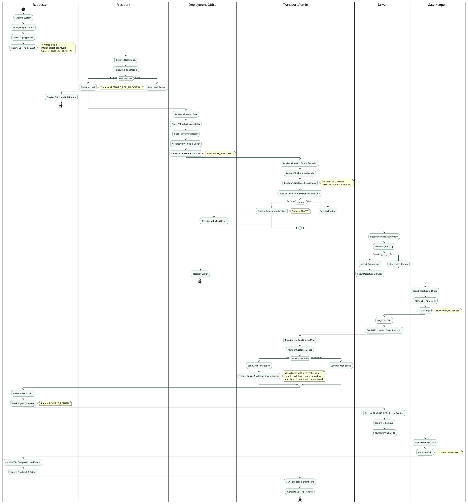

# Activity Diagram — VIP Trip Request (Full Flow)

**Approval path:** Any requester → President (direct) → Deployment Office → Transport Admin → Driver → Gate Keeper → Trip Execution (with Geofence monitoring) → Completion

VIP trips skip all intermediate approvals and go directly to the President regardless of who submits.

