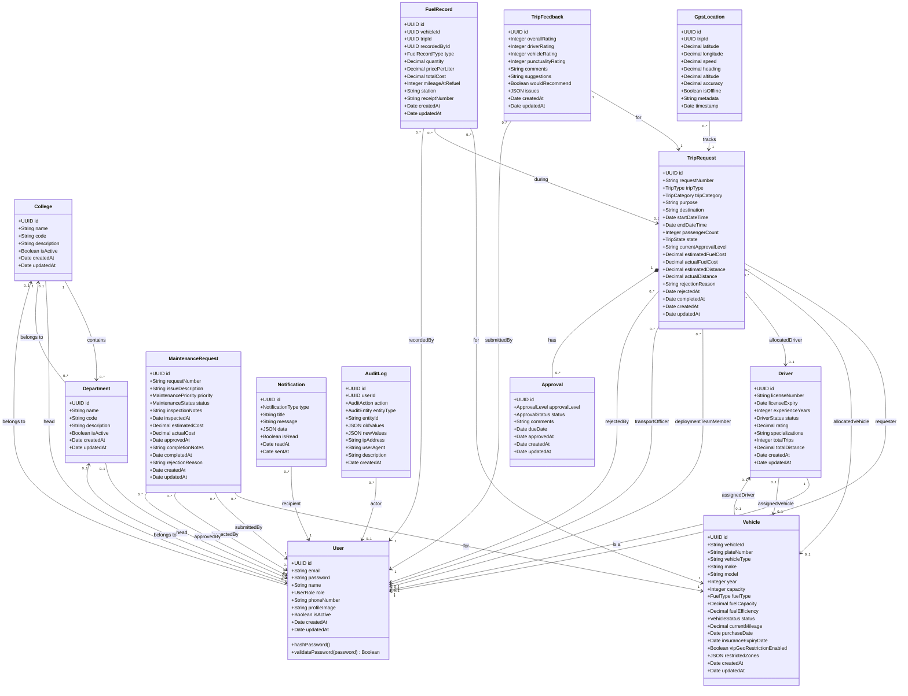

# Fleet Management System — Class Diagram

```mermaid
classDiagram

    class College {
        +UUID id
        +String name
        +String code
        +String description
        +Boolean isActive
        +Date createdAt
        +Date updatedAt
    }

    class Department {
        +UUID id
        +String name
        +String code
        +String description
        +Boolean isActive
        +Date createdAt
        +Date updatedAt
    }

    class User {
        +UUID id
        +String email
        +String password
        +String name
        +UserRole role
        +String phoneNumber
        +String profileImage
        +Boolean isActive
        +Date createdAt
        +Date updatedAt
        +hashPassword()
        +validatePassword(password) Boolean
    }

    class Driver {
        +UUID id
        +String licenseNumber
        +Date licenseExpiry
        +Integer experienceYears
        +DriverStatus status
        +Decimal rating
        +String specializations
        +Integer totalTrips
        +Decimal totalDistance
        +Date createdAt
        +Date updatedAt
    }

    class Vehicle {
        +UUID id
        +String vehicleId
        +String plateNumber
        +String vehicleType
        +String make
        +String model
        +Integer year
        +Integer capacity
        +FuelType fuelType
        +Decimal fuelCapacity
        +Decimal fuelEfficiency
        +VehicleStatus status
        +Decimal currentMileage
        +Date purchaseDate
        +Date insuranceExpiryDate
        +Boolean vipGeoRestrictionEnabled
        +JSON restrictedZones
        +Date createdAt
        +Date updatedAt
    }

    class TripRequest {
        +UUID id
        +String requestNumber
        +TripType tripType
        +TripCategory tripCategory
        +String purpose
        +String destination
        +Date startDateTime
        +Date endDateTime
        +Integer passengerCount
        +TripState state
        +String currentApprovalLevel
        +Decimal estimatedFuelCost
        +Decimal actualFuelCost
        +Decimal estimatedDistance
        +Decimal actualDistance
        +String rejectionReason
        +Date rejectedAt
        +Date completedAt
        +Date createdAt
        +Date updatedAt
    }

    class Approval {
        +UUID id
        +ApprovalLevel approvalLevel
        +ApprovalStatus status
        +String comments
        +Date dueDate
        +Date approvedAt
        +Date createdAt
        +Date updatedAt
    }

    class TripFeedback {
        +UUID id
        +Integer overallRating
        +Integer driverRating
        +Integer vehicleRating
        +Integer punctualityRating
        +String comments
        +String suggestions
        +Boolean wouldRecommend
        +JSON issues
        +Date createdAt
        +Date updatedAt
    }

    class GpsLocation {
        +UUID id
        +UUID tripId
        +Decimal latitude
        +Decimal longitude
        +Decimal speed
        +Decimal heading
        +Decimal altitude
        +Decimal accuracy
        +Boolean isOffline
        +String metadata
        +Date timestamp
    }

    class FuelRecord {
        +UUID id
        +UUID vehicleId
        +UUID tripId
        +UUID recordedById
        +FuelRecordType type
        +Decimal quantity
        +Decimal pricePerLiter
        +Decimal totalCost
        +Integer mileageAtRefuel
        +String station
        +String receiptNumber
        +Date createdAt
        +Date updatedAt
    }

    class MaintenanceRequest {
        +UUID id
        +String requestNumber
        +String issueDescription
        +MaintenancePriority priority
        +MaintenanceStatus status
        +String inspectionNotes
        +Date inspectedAt
        +Decimal estimatedCost
        +Decimal actualCost
        +Date approvedAt
        +String completionNotes
        +Date completedAt
        +String rejectionReason
        +Date createdAt
        +Date updatedAt
    }

    class Notification {
        +UUID id
        +NotificationType type
        +String title
        +String message
        +JSON data
        +Boolean isRead
        +Date readAt
        +Date sentAt
    }

    class AuditLog {
        +UUID id
        +UUID userId
        +AuditAction action
        +AuditEntity entityType
        +String entityId
        +JSON oldValues
        +JSON newValues
        +String ipAddress
        +String userAgent
        +String description
        +Date createdAt
    }

    College "1" --> "0..*" Department : contains
    College "0..1" --> "0..1" User : head
    Department "0..*" --> "1" College : belongs to
    Department "0..1" --> "0..1" User : head
    User "0..*" --> "0..1" Department : belongs to
    User "0..*" --> "0..1" College : belongs to
    Driver "1" --> "1" User : is a
    Driver "0..1" --> "0..1" Vehicle : assignedVehicle
    Vehicle "0..1" --> "0..1" Driver : assignedDriver
    TripRequest "0..*" --> "1" User : requester
    TripRequest "0..*" --> "0..1" Vehicle : allocatedVehicle
    TripRequest "0..*" --> "0..1" Driver : allocatedDriver
    TripRequest "0..*" --> "0..1" User : deploymentTeamMember
    TripRequest "0..*" --> "0..1" User : transportOfficer
    TripRequest "0..*" --> "0..1" User : rejectedBy
    TripRequest "1" *-- "0..*" Approval : has
    TripFeedback "1" --> "1" TripRequest : for
    TripFeedback "0..*" --> "1" User : submittedBy
    GpsLocation "0..*" --> "1" TripRequest : tracks
    FuelRecord "0..*" --> "1" Vehicle : for
    FuelRecord "0..*" --> "0..1" TripRequest : during
    FuelRecord "0..*" --> "1" User : recordedBy
    MaintenanceRequest "0..*" --> "1" Vehicle : for
    MaintenanceRequest "0..*" --> "1" User : submittedBy
    MaintenanceRequest "0..*" --> "0..1" User : inspectedBy
    MaintenanceRequest "0..*" --> "0..1" User : approvedBy
    Notification "0..*" --> "1" User : recipient
    AuditLog "0..*" --> "0..1" User : actor
```
