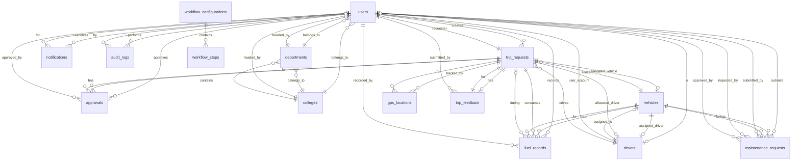

# Fleet Management System - Database Schema Design

## Overview

This document describes the complete database schema for the Fleet Management System. The system uses PostgreSQL as the primary database with TypeORM as the ORM.

## Database: `fleet_management`

---

## Entity Relationship Diagram (ERD)



---

## Tables


### 1. users

Stores all system users across different roles.

| Column | Type | Constraints | Description |
|--------|------|-------------|-------------|
| id | UUID | PRIMARY KEY | Unique identifier |
| email | VARCHAR | UNIQUE, NOT NULL | User email address |
| password | VARCHAR | NOT NULL | Hashed password (bcrypt) |
| name | VARCHAR | NOT NULL | Full name |
| role | ENUM | NOT NULL | User role (see UserRole enum) |
| phoneNumber | VARCHAR | NULL | Contact phone number |
| profileImage | TEXT | NULL | Profile image URL/path |
| departmentId | UUID | FOREIGN KEY, NULL | Reference to departments |
| collegeId | UUID | FOREIGN KEY, NULL | Reference to colleges |
| isActive | BOOLEAN | DEFAULT true | Account status |
| resetToken | VARCHAR | NULL | Password reset token |
| resetTokenExpiry | TIMESTAMP | NULL | Token expiration time |
| createdAt | TIMESTAMP | NOT NULL | Record creation time |
| updatedAt | TIMESTAMP | NOT NULL | Last update time |

**UserRole Enum Values:**
- User (Employee)
- DepartmentHead
- CollegeHead
- Dean
- President
- DeploymentTeam
- TransportOffice
- MaintenanceTeam
- Driver
- Gate
- Developer
- SystemAdmin

**Indexes:**
- PRIMARY KEY on `id`
- UNIQUE INDEX on `email`
- INDEX on `role`
- INDEX on `departmentId`
- INDEX on `collegeId`

---

### 2. colleges

Stores university colleges.

| Column | Type | Constraints | Description |
|--------|------|-------------|-------------|
| id | UUID | PRIMARY KEY | Unique identifier |
| name | VARCHAR | NOT NULL | College name |
| code | VARCHAR | UNIQUE, NOT NULL | College code |
| description | VARCHAR | NULL | College description |
| headId | UUID | FOREIGN KEY, NULL | Reference to users (dean) |
| isActive | BOOLEAN | DEFAULT true | Active status |
| createdAt | TIMESTAMP | NOT NULL | Record creation time |
| updatedAt | TIMESTAMP | NOT NULL | Last update time |

**Indexes:**
- PRIMARY KEY on `id`
- UNIQUE INDEX on `code`

---

### 3. departments

Stores university departments within colleges.

| Column | Type | Constraints | Description |
|--------|------|-------------|-------------|
| id | UUID | PRIMARY KEY | Unique identifier |
| name | VARCHAR | NOT NULL | Department name |
| code | VARCHAR | UNIQUE, NOT NULL | Department code |
| description | VARCHAR | NULL | Department description |
| collegeId | UUID | FOREIGN KEY, NOT NULL | Reference to colleges |
| headId | UUID | FOREIGN KEY, NULL | Reference to users (head) |
| isActive | BOOLEAN | DEFAULT true | Active status |
| createdAt | TIMESTAMP | NOT NULL | Record creation time |
| updatedAt | TIMESTAMP | NOT NULL | Last update time |

**Indexes:**
- PRIMARY KEY on `id`
- UNIQUE INDEX on `code`
- INDEX on `collegeId`

---

### 4. vehicles

Stores fleet vehicles.

| Column | Type | Constraints | Description |
|--------|------|-------------|-------------|
| id | UUID | PRIMARY KEY | Unique identifier |
| vehicleId | VARCHAR | UNIQUE, NULL | Custom vehicle ID |
| plateNumber | VARCHAR | UNIQUE, NOT NULL | License plate number |
| vehicleType | VARCHAR | NULL | Type of vehicle |
| make | VARCHAR | NOT NULL | Vehicle manufacturer |
| model | VARCHAR | NOT NULL | Vehicle model |
| year | INTEGER | NOT NULL | Manufacturing year |
| capacity | INTEGER | NOT NULL | Passenger capacity |
| fuelType | ENUM | NOT NULL | Fuel type (see FuelType) |
| fuelCapacity | DECIMAL(10,2) | NULL | Fuel tank capacity (liters) |
| status | ENUM | DEFAULT 'Active' | Vehicle status (see VehicleStatus) |
| currentMileage | DECIMAL(10,2) | DEFAULT 0 | Current odometer reading |
| lastMaintenanceDate | TIMESTAMP | NULL | Last maintenance date |
| nextMaintenanceDate | TIMESTAMP | NULL | Next scheduled maintenance |
| purchaseDate | DATE | NULL | Purchase date |
| insuranceExpiryDate | DATE | NULL | Insurance expiry date |
| nextServiceDate | DATE | NULL | Next service date |
| color | VARCHAR | NULL | Vehicle color |
| vinNumber | VARCHAR | NULL | Vehicle identification number |
| notes | TEXT | NULL | Additional notes |
| vipGeoRestrictionEnabled | BOOLEAN | DEFAULT false | VIP geofence restriction |
| restrictedZones | JSON | NULL | Restricted zone coordinates |
| assignedDriverId | UUID | FOREIGN KEY, NULL | Reference to drivers |
| createdAt | TIMESTAMP | NOT NULL | Record creation time |
| updatedAt | TIMESTAMP | NOT NULL | Last update time |

**FuelType Enum Values:**
- Gasoline
- Diesel
- Electric
- Hybrid

**VehicleStatus Enum Values:**
- Active
- Maintenance
- Inactive

**Indexes:**
- PRIMARY KEY on `id`
- UNIQUE INDEX on `plateNumber`
- UNIQUE INDEX on `vehicleId`
- INDEX on `status`
- INDEX on `assignedDriverId`

---

### 5. drivers

Stores driver information.

| Column | Type | Constraints | Description |
|--------|------|-------------|-------------|
| id | UUID | PRIMARY KEY | Unique identifier |
| userId | UUID | FOREIGN KEY, NOT NULL | Reference to users |
| assignedVehicleId | UUID | FOREIGN KEY, NULL | Reference to vehicles |
| licenseNumber | VARCHAR | UNIQUE, NOT NULL | Driver's license number |
| licenseExpiry | DATE | NOT NULL | License expiration date |
| experienceYears | INTEGER | NOT NULL | Years of driving experience |
| status | ENUM | DEFAULT 'Available' | Driver status (see DriverStatus) |
| rating | DECIMAL(3,2) | DEFAULT 0 | Average rating (0-5) |
| specializations | TEXT | NULL | Special skills/certifications |
| notes | TEXT | NULL | Additional notes |
| totalTrips | INTEGER | DEFAULT 0 | Total trips completed |
| totalDistance | DECIMAL(10,2) | DEFAULT 0 | Total distance driven (km) |
| createdAt | TIMESTAMP | NOT NULL | Record creation time |
| updatedAt | TIMESTAMP | NOT NULL | Last update time |

**DriverStatus Enum Values:**
- Available
- OnTrip
- OnLeave
- Inactive

**Indexes:**
- PRIMARY KEY on `id`
- UNIQUE INDEX on `licenseNumber`
- UNIQUE INDEX on `assignedVehicleId` (where NOT NULL)
- INDEX on `userId`
- INDEX on `status`

---

### 6. trip_requests

Stores all trip requests and their lifecycle.

| Column | Type | Constraints | Description |
|--------|------|-------------|-------------|
| id | UUID | PRIMARY KEY | Unique identifier |
| requestNumber | VARCHAR | UNIQUE, NOT NULL | Human-readable trip number |
| requesterId | UUID | FOREIGN KEY, NOT NULL | Reference to users (requester) |
| tripType | ENUM | NOT NULL | Trip type (see TripType) |
| tripCategory | ENUM | DEFAULT 'STANDARD' | Trip category (see TripCategory) |
| purpose | TEXT | NOT NULL | Purpose of the trip |
| destination | VARCHAR | NOT NULL | Destination address |
| startDateTime | TIMESTAMP | NOT NULL | Trip start date and time |
| endDateTime | TIMESTAMP | NOT NULL | Trip end date and time |
| passengerCount | INTEGER | NOT NULL | Number of passengers |
| state | ENUM | DEFAULT 'DRAFT' | Current trip state (see TripState) |
| currentApprovalLevel | VARCHAR | NULL | Current approval level |
| allocatedVehicleId | UUID | FOREIGN KEY, NULL | Reference to vehicles |
| allocatedDriverId | UUID | FOREIGN KEY, NULL | Reference to drivers |
| deploymentTeamMemberId | UUID | FOREIGN KEY, NULL | Reference to users |
| transportOfficerId | UUID | FOREIGN KEY, NULL | Reference to users |
| estimatedFuelCost | DECIMAL(10,2) | NULL | Estimated fuel cost |
| actualFuelCost | DECIMAL(10,2) | NULL | Actual fuel cost |
| estimatedDistance | DECIMAL(10,2) | NULL | Estimated distance (km) |
| actualDistance | DECIMAL(10,2) | NULL | Actual distance (km) |
| rejectionReason | TEXT | NULL | Reason for rejection |
| rejectedById | UUID | FOREIGN KEY, NULL | Reference to users |
| rejectedAt | TIMESTAMP | NULL | Rejection timestamp |
| completedAt | TIMESTAMP | NULL | Completion timestamp |
| createdAt | TIMESTAMP | NOT NULL | Record creation time |
| updatedAt | TIMESTAMP | NOT NULL | Last update time |

**TripType Enum Values:**
- Normal
- VIP

**TripCategory Enum Values:**
- STANDARD
- VIP
- SERVICE

**TripState Enum Values:**
- DRAFT
- PENDING_DEPARTMENT
- PENDING_COLLEGE
- PENDING_PRESIDENT
- REJECTED
- AUTO_REJECTED_TIMEOUT
- APPROVED_FOR_ALLOCATION
- CAR_ALLOCATED
- PENDING_TRANSPORT_CONFIRM
- READY
- IN_PROGRESS
- COMPLETED
- CANCELLED

**Indexes:**
- PRIMARY KEY on `id`
- UNIQUE INDEX on `requestNumber`
- INDEX on `requesterId`
- INDEX on `state`
- INDEX on `allocatedVehicleId`
- INDEX on `allocatedDriverId`
- INDEX on `startDateTime`
- INDEX on `createdAt`

---

### 7. approvals

Stores approval records for trip requests.

| Column | Type | Constraints | Description |
|--------|------|-------------|-------------|
| id | UUID | PRIMARY KEY | Unique identifier |
| tripRequestId | UUID | FOREIGN KEY, NOT NULL | Reference to trip_requests |
| approvalLevel | ENUM | NOT NULL | Approval level (see ApprovalLevel) |
| status | ENUM | DEFAULT 'Pending' | Approval status (see ApprovalStatus) |
| approverId | UUID | FOREIGN KEY, NULL | Reference to users (approver) |
| comments | TEXT | NULL | Approver comments |
| dueDate | TIMESTAMP | NOT NULL | Approval deadline |
| approvedAt | TIMESTAMP | NULL | Approval timestamp |
| createdAt | TIMESTAMP | NOT NULL | Record creation time |
| updatedAt | TIMESTAMP | NOT NULL | Last update time |

**ApprovalLevel Enum Values:**
- Department
- College
- Dean
- President
- Deployment
- Transport

**ApprovalStatus Enum Values:**
- Pending
- Approved
- Rejected
- AutoRejectedTimeout

**Indexes:**
- PRIMARY KEY on `id`
- INDEX on `tripRequestId`
- INDEX on `approverId`
- INDEX on `status`
- INDEX on `dueDate`

---

### 8. trip_feedback

Stores feedback for completed trips.

| Column | Type | Constraints | Description |
|--------|------|-------------|-------------|
| id | UUID | PRIMARY KEY | Unique identifier |
| tripRequestId | UUID | FOREIGN KEY, UNIQUE, NOT NULL | Reference to trip_requests |
| submittedById | UUID | FOREIGN KEY, NOT NULL | Reference to users |
| overallRating | INTEGER | NOT NULL | Overall rating (1-5) |
| driverRating | INTEGER | NULL | Driver rating (1-5) |
| vehicleRating | INTEGER | NULL | Vehicle rating (1-5) |
| punctualityRating | INTEGER | NULL | Punctuality rating (1-5) |
| comments | TEXT | NULL | Feedback comments |
| suggestions | TEXT | NULL | Improvement suggestions |
| wouldRecommend | BOOLEAN | DEFAULT false | Would recommend service |
| issues | JSON | NULL | Array of reported issues |
| createdAt | TIMESTAMP | NOT NULL | Record creation time |
| updatedAt | TIMESTAMP | NOT NULL | Last update time |

**FeedbackRating Enum Values:**
- 5 (EXCELLENT)
- 4 (GOOD)
- 3 (AVERAGE)
- 2 (POOR)
- 1 (TERRIBLE)

**Indexes:**
- PRIMARY KEY on `id`
- UNIQUE INDEX on `tripRequestId`
- INDEX on `submittedById`
- INDEX on `overallRating`

---

### 9. fuel_records

Stores fuel consumption and refueling records.

| Column | Type | Constraints | Description |
|--------|------|-------------|-------------|
| id | UUID | PRIMARY KEY | Unique identifier |
| vehicleId | UUID | FOREIGN KEY, NOT NULL | Reference to vehicles |
| tripId | UUID | FOREIGN KEY, NULL | Reference to trip_requests |
| recordedById | UUID | FOREIGN KEY, NOT NULL | Reference to users |
| type | ENUM | NOT NULL | Record type (see FuelRecordType) |
| quantity | DECIMAL(10,2) | NOT NULL | Fuel quantity (liters) |
| pricePerLiter | DECIMAL(10,2) | NOT NULL | Price per liter |
| totalCost | DECIMAL(10,2) | NOT NULL | Total cost |
| mileageAtRefuel | INTEGER | NULL | Odometer reading |
| station | VARCHAR | NULL | Fuel station name |
| receiptNumber | VARCHAR | NULL | Receipt number |
| notes | TEXT | NULL | Additional notes |
| createdAt | TIMESTAMP | NOT NULL | Record creation time |
| updatedAt | TIMESTAMP | NOT NULL | Last update time |

**FuelRecordType Enum Values:**
- Refuel
- TripConsumption
- Adjustment

**Indexes:**
- PRIMARY KEY on `id`
- INDEX on `vehicleId`
- INDEX on `tripId`
- INDEX on `recordedById`
- INDEX on `createdAt`

---

### 10. maintenance_requests

Stores vehicle maintenance requests and records.

| Column | Type | Constraints | Description |
|--------|------|-------------|-------------|
| id | UUID | PRIMARY KEY | Unique identifier |
| requestNumber | VARCHAR | UNIQUE, NOT NULL | Human-readable request number |
| vehicleId | UUID | FOREIGN KEY, NOT NULL | Reference to vehicles |
| submittedById | UUID | FOREIGN KEY, NOT NULL | Reference to users |
| issueDescription | TEXT | NOT NULL | Description of issue |
| priority | ENUM | DEFAULT 'Medium' | Priority level (see MaintenancePriority) |
| status | ENUM | DEFAULT 'Submitted' | Request status (see MaintenanceStatus) |
| inspectionNotes | TEXT | NULL | Inspection findings |
| inspectedById | UUID | FOREIGN KEY, NULL | Reference to users |
| inspectedAt | TIMESTAMP | NULL | Inspection timestamp |
| estimatedCost | DECIMAL(10,2) | NULL | Estimated repair cost |
| actualCost | DECIMAL(10,2) | NULL | Actual repair cost |
| approvedById | UUID | FOREIGN KEY, NULL | Reference to users |
| approvedAt | TIMESTAMP | NULL | Approval timestamp |
| completionNotes | TEXT | NULL | Completion notes |
| completedAt | TIMESTAMP | NULL | Completion timestamp |
| rejectionReason | TEXT | NULL | Reason for rejection |
| createdAt | TIMESTAMP | NOT NULL | Record creation time |
| updatedAt | TIMESTAMP | NOT NULL | Last update time |

**MaintenancePriority Enum Values:**
- Low
- Medium
- High
- Critical

**MaintenanceStatus Enum Values:**
- Submitted
- UnderInspection
- EstimateProvided
- BudgetApproved
- InProgress
- Completed
- Rejected

**Indexes:**
- PRIMARY KEY on `id`
- UNIQUE INDEX on `requestNumber`
- INDEX on `vehicleId`
- INDEX on `submittedById`
- INDEX on `status`
- INDEX on `priority`
- INDEX on `createdAt`

---

### 11. gps_locations

Stores GPS tracking data for trips.

| Column | Type | Constraints | Description |
|--------|------|-------------|-------------|
| id | UUID | PRIMARY KEY | Unique identifier |
| tripId | UUID | FOREIGN KEY, NOT NULL | Reference to trip_requests |
| latitude | DECIMAL(10,7) | NOT NULL | Latitude coordinate |
| longitude | DECIMAL(10,7) | NOT NULL | Longitude coordinate |
| speed | DECIMAL(5,2) | NULL | Speed in km/h |
| heading | DECIMAL(5,2) | NULL | Direction in degrees (0-360) |
| altitude | DECIMAL(6,2) | NULL | Altitude in meters |
| accuracy | DECIMAL(4,2) | NULL | GPS accuracy in meters |
| isOffline | BOOLEAN | DEFAULT false | Recorded offline flag |
| metadata | TEXT | NULL | Additional metadata (JSON string) |
| timestamp | TIMESTAMP | NOT NULL | Location timestamp |

**Indexes:**
- PRIMARY KEY on `id`
- INDEX on `tripId, timestamp`
- INDEX on `timestamp`

---

### 12. notifications

Stores user notifications.

| Column | Type | Constraints | Description |
|--------|------|-------------|-------------|
| id | UUID | PRIMARY KEY | Unique identifier |
| recipientId | UUID | FOREIGN KEY, NOT NULL | Reference to users |
| type | ENUM | NOT NULL | Notification type (see NotificationType) |
| title | VARCHAR | NOT NULL | Notification title |
| message | TEXT | NOT NULL | Notification message |
| data | JSON | NULL | Additional data payload |
| isRead | BOOLEAN | DEFAULT false | Read status |
| readAt | TIMESTAMP | NULL | Read timestamp |
| sentAt | TIMESTAMP | NOT NULL | Sent timestamp |

**NotificationType Enum Values:**
- TripSubmitted
- TripApproved
- TripRejected
- TripAutoRejected
- TripAllocated
- TripReady
- TripStarted
- TripCompleted
- TripCompletedEarly
- TripCancelled
- ApprovalReminder
- ApprovalTimeout
- FeedbackSubmitted
- NewTripRequest
- ApprovalPending
- GeofenceWarning
- GeofenceViolation

**Indexes:**
- PRIMARY KEY on `id`
- INDEX on `recipientId`
- INDEX on `isRead`
- INDEX on `sentAt`

---

### 13. audit_logs

Stores audit trail for all system actions.

| Column | Type | Constraints | Description |
|--------|------|-------------|-------------|
| id | UUID | PRIMARY KEY | Unique identifier |
| userId | UUID | FOREIGN KEY, NULL | Reference to users |
| action | ENUM | NOT NULL | Action performed (see AuditAction) |
| entityType | ENUM | NOT NULL | Entity type (see AuditEntity) |
| entityId | VARCHAR | NOT NULL | Entity identifier |
| oldValues | JSON | NULL | Previous values |
| newValues | JSON | NULL | New values |
| ipAddress | VARCHAR | NULL | User IP address |
| userAgent | VARCHAR | NULL | User agent string |
| description | TEXT | NULL | Action description |
| createdAt | TIMESTAMP | NOT NULL | Action timestamp |

**AuditAction Enum Values:**
- CREATE
- UPDATE
- DELETE
- APPROVE
- REJECT
- SUBMIT
- CANCEL
- ALLOCATE
- START
- COMPLETE
- LOGIN
- LOGOUT

**AuditEntity Enum Values:**
- User
- Trip
- Vehicle
- Driver
- Maintenance
- College
- Department
- Approval

**Indexes:**
- PRIMARY KEY on `id`
- INDEX on `entityType, entityId`
- INDEX on `userId, createdAt`
- INDEX on `action, createdAt`

---

### 14. workflow_configurations

Stores workflow configuration for different trip types.

| Column | Type | Constraints | Description |
|--------|------|-------------|-------------|
| id | UUID | PRIMARY KEY | Unique identifier |
| name | VARCHAR | NOT NULL | Workflow name |
| tripType | ENUM | NOT NULL | Trip type (Normal/VIP) |
| isActive | BOOLEAN | DEFAULT true | Active status |
| steps | JSON | NOT NULL | Workflow steps configuration |
| createdAt | TIMESTAMP | NOT NULL | Record creation time |
| updatedAt | TIMESTAMP | NOT NULL | Last update time |

**Workflow Steps JSON Structure:**
```json
{
  "name": "string",
  "order": "number",
  "role": "string",
  "state": "string",
  "timeoutHours": "number",
  "nextStateOnApprove": "string",
  "nextStateOnReject": "string",
  "nextStateOnTimeout": "string",
  "actions": [
    {
      "type": "notification|email|webhook",
      "trigger": "onEnter|onApprove|onReject|onTimeout|onWarning",
      "config": {}
    }
  ]
}
```

**Indexes:**
- PRIMARY KEY on `id`
- INDEX on `tripType`
- INDEX on `isActive`

---

## Relationships Summary

### One-to-Many Relationships

1. **colleges → departments**: One college has many departments
2. **users → trip_requests**: One user creates many trip requests
3. **users → approvals**: One user approves many trips
4. **users → notifications**: One user receives many notifications
5. **users → audit_logs**: One user performs many actions
6. **users → fuel_records**: One user records many fuel entries
7. **users → maintenance_requests**: One user submits many maintenance requests
8. **vehicles → trip_requests**: One vehicle is allocated to many trips
9. **vehicles → fuel_records**: One vehicle has many fuel records
10. **vehicles → maintenance_requests**: One vehicle has many maintenance requests
11. **drivers → trip_requests**: One driver drives many trips
12. **trip_requests → approvals**: One trip has many approvals
13. **trip_requests → gps_locations**: One trip has many GPS locations
14. **trip_requests → fuel_records**: One trip has many fuel records

### One-to-One Relationships

1. **drivers ↔ users**: One driver has one user account
2. **trip_requests ↔ trip_feedback**: One trip has one feedback
3. **drivers ↔ vehicles**: One driver is assigned to one vehicle (strict 1-to-1)

### Many-to-One Relationships

1. **users → departments**: Many users belong to one department
2. **users → colleges**: Many users belong to one college
3. **departments → colleges**: Many departments belong to one college
4. **departments → users (head)**: Many departments have one head
5. **colleges → users (head)**: Many colleges have one dean

---

## Database Constraints

### Foreign Key Constraints

All foreign key relationships have the following constraints:
- **ON DELETE**: Varies by relationship (CASCADE, SET NULL, RESTRICT)
- **ON UPDATE**: CASCADE

### Unique Constraints

1. **users.email**: Unique email addresses
2. **colleges.code**: Unique college codes
3. **departments.code**: Unique department codes
4. **vehicles.plateNumber**: Unique plate numbers
5. **vehicles.vehicleId**: Unique vehicle IDs
6. **drivers.licenseNumber**: Unique license numbers
7. **drivers.assignedVehicleId**: Unique vehicle assignment (where NOT NULL)
8. **trip_requests.requestNumber**: Unique trip request numbers
9. **trip_feedback.tripRequestId**: One feedback per trip
10. **maintenance_requests.requestNumber**: Unique maintenance request numbers

### Check Constraints

1. **users.role**: Must be valid UserRole enum value
2. **vehicles.year**: Must be between 1900 and current year + 1
3. **vehicles.capacity**: Must be greater than 0
4. **drivers.experienceYears**: Must be >= 0
5. **drivers.rating**: Must be between 0 and 5
6. **trip_requests.passengerCount**: Must be greater than 0
7. **trip_requests.endDateTime**: Must be after startDateTime
8. **trip_feedback ratings**: Must be between 1 and 5
9. **fuel_records.quantity**: Must be greater than 0
10. **fuel_records.totalCost**: Must be >= 0
11. **maintenance_requests costs**: Must be >= 0

---

## Indexes Strategy

### Performance Indexes

1. **Frequently Queried Columns**:
   - `users.role`
   - `trip_requests.state`
   - `vehicles.status`
   - `drivers.status`
   - `approvals.status`
   - `maintenance_requests.status`

2. **Foreign Key Indexes**:
   - All foreign key columns have indexes for join performance

3. **Timestamp Indexes**:
   - `trip_requests.startDateTime`
   - `trip_requests.createdAt`
   - `notifications.sentAt`
   - `audit_logs.createdAt`
   - `gps_locations.timestamp`

4. **Composite Indexes**:
   - `gps_locations(tripId, timestamp)` - For trip tracking queries
   - `audit_logs(userId, createdAt)` - For user activity queries
   - `audit_logs(entityType, entityId)` - For entity audit trail
   - `audit_logs(action, createdAt)` - For action-based queries

---

## Data Types Rationale

### UUID vs Integer IDs
- **UUID**: Used for all primary keys for:
  - Distributed system compatibility
  - Security (non-sequential)
  - Merge-friendly across environments

### DECIMAL for Money and Measurements
- **DECIMAL(10,2)**: Used for currency (fuel costs, maintenance costs)
- **DECIMAL(10,7)**: Used for GPS coordinates (high precision)
- **DECIMAL(3,2)**: Used for ratings (0.00 to 5.00)

### ENUM vs VARCHAR
- **ENUM**: Used for fixed, known values (roles, statuses, types)
- **VARCHAR**: Used for variable text data

### JSON Columns
- **Simple-JSON**: Used for structured data that doesn't need querying
  - `vehicles.restrictedZones`
  - `notifications.data`
  - `workflow_configurations.steps`
  - `trip_feedback.issues`

---

## Database Size Estimates

### Expected Growth Rates (Annual)

| Table | Records/Year | Storage/Record | Total/Year |
|-------|--------------|----------------|------------|
| users | 500 | 1 KB | 500 KB |
| trip_requests | 10,000 | 2 KB | 20 MB |
| approvals | 30,000 | 0.5 KB | 15 MB |
| gps_locations | 5,000,000 | 0.3 KB | 1.5 GB |
| notifications | 100,000 | 0.5 KB | 50 MB |
| audit_logs | 200,000 | 1 KB | 200 MB |
| fuel_records | 15,000 | 0.5 KB | 7.5 MB |
| maintenance_requests | 500 | 1 KB | 500 KB |
| trip_feedback | 8,000 | 1 KB | 8 MB |

**Total Estimated Growth**: ~2 GB/year

---

## Backup and Maintenance Strategy

### Backup Schedule
- **Full Backup**: Daily at 2:00 AM
- **Incremental Backup**: Every 6 hours
- **Retention**: 30 days for daily, 7 days for incremental

### Maintenance Tasks
- **VACUUM**: Weekly on Sunday at 3:00 AM
- **ANALYZE**: Daily at 4:00 AM
- **REINDEX**: Monthly on first Sunday at 5:00 AM

### Archival Strategy
- **audit_logs**: Archive records older than 2 years
- **gps_locations**: Archive records older than 1 year
- **notifications**: Delete read notifications older than 6 months

---

## Security Considerations

### Sensitive Data
1. **users.password**: Hashed with bcrypt (salt rounds: 10)
2. **users.resetToken**: Temporary, expires after use
3. **audit_logs**: Contains IP addresses and user agents

### Access Control
- Row-level security based on user roles
- Department/college-level data isolation
- Audit logging for all sensitive operations

### Encryption
- **At Rest**: Database encryption enabled
- **In Transit**: SSL/TLS for all connections
- **Application Level**: Sensitive fields encrypted before storage

---

## Migration Strategy

### Version Control
- All schema changes tracked in migrations
- Migration files stored in `Backend/src/migrations/`
- TypeORM migration system used

### Deployment Process
1. Backup current database
2. Run pending migrations
3. Verify data integrity
4. Update application
5. Monitor for issues

---

## Performance Optimization

### Query Optimization
- Use of appropriate indexes
- Eager loading for frequently accessed relations
- Pagination for large result sets
- Query result caching where appropriate

### Connection Pooling
- Min connections: 5
- Max connections: 20
- Idle timeout: 10 minutes
- Connection timeout: 30 seconds

---

## Monitoring and Alerts

### Key Metrics
- Query execution time
- Connection pool usage
- Table sizes
- Index usage statistics
- Slow query log

### Alert Thresholds
- Query time > 1 second
- Connection pool > 80% usage
- Table size growth > 20% per week
- Failed queries > 1% of total

---

## Summary

This database schema supports a comprehensive fleet management system with:
- **14 main tables** covering all system entities
- **Strong referential integrity** through foreign keys
- **Comprehensive audit trail** for compliance
- **Flexible workflow system** for different trip types
- **Real-time tracking** capabilities
- **Scalable design** for future growth
- **Security-first approach** with encryption and access control

The schema is designed to handle:
- Multiple user roles and permissions
- Complex approval workflows
- Real-time GPS tracking
- Comprehensive reporting and analytics
- Audit and compliance requirements
- Maintenance and fuel management
- Feedback and rating systems
