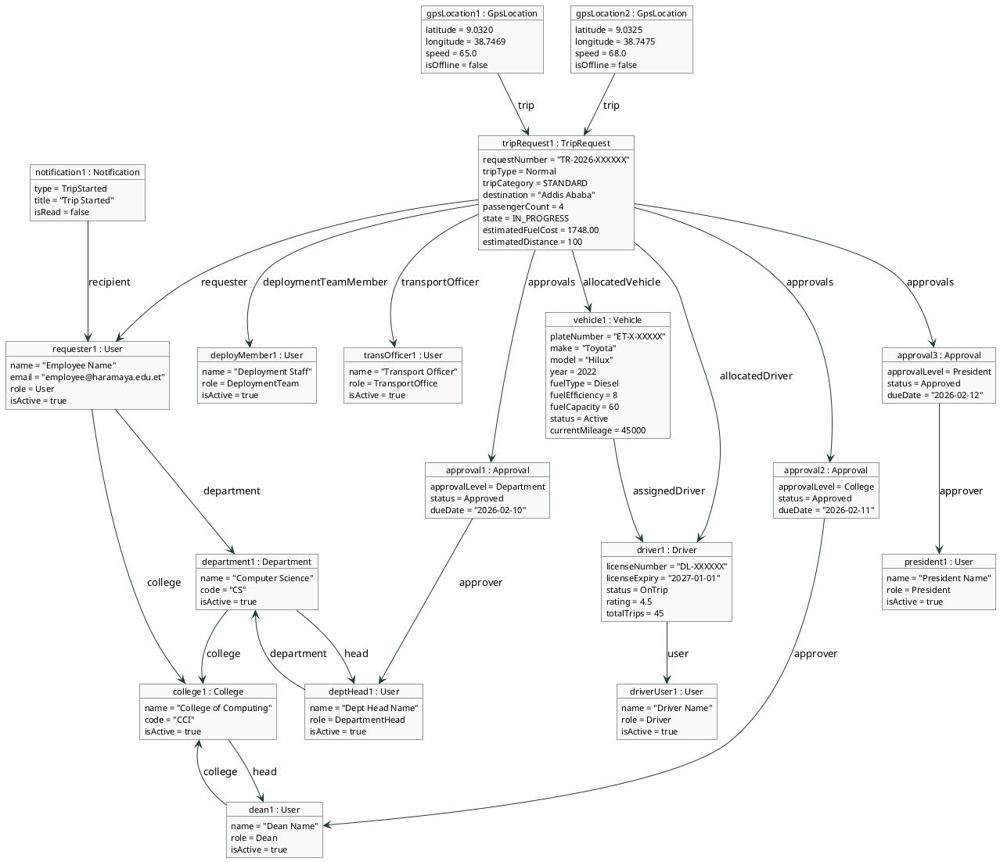

# Fleet Management System — Object Diagram

> A snapshot of object instances at the moment a trip is IN_PROGRESS.
> Values are representative examples, not real data.

---

---

## What this diagram shows

This is a snapshot of the system at the moment a trip is `IN_PROGRESS`:

- **College and Department** — the organizational units the requester belongs to
- **Users** — all 7 users involved: requester, dept head, dean, president, deployment member, transport officer, and driver
- **Vehicle** — the allocated vehicle with its current status (`Active`) and fuel specs
- **Driver** — linked to their user account, status is `OnTrip`
- **TripRequest** — the central object in `IN_PROGRESS` state with estimated fuel cost
- **Approvals** — 3 approval records, one per level, all `Approved`
- **GpsLocations** — 2 recent GPS points posted by the driver
- **Notification** — a `TripStarted` notification sent to the requester
