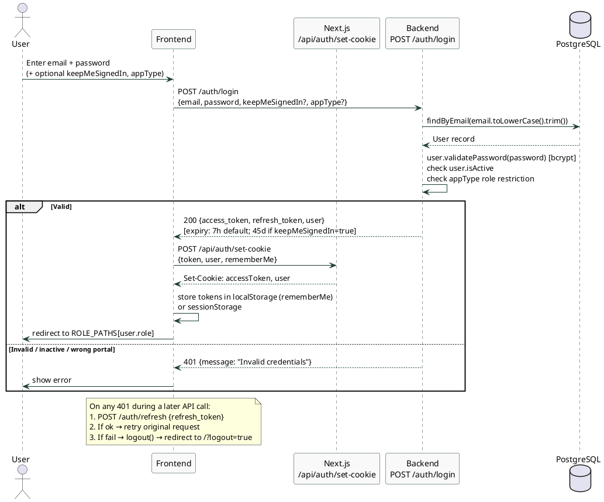
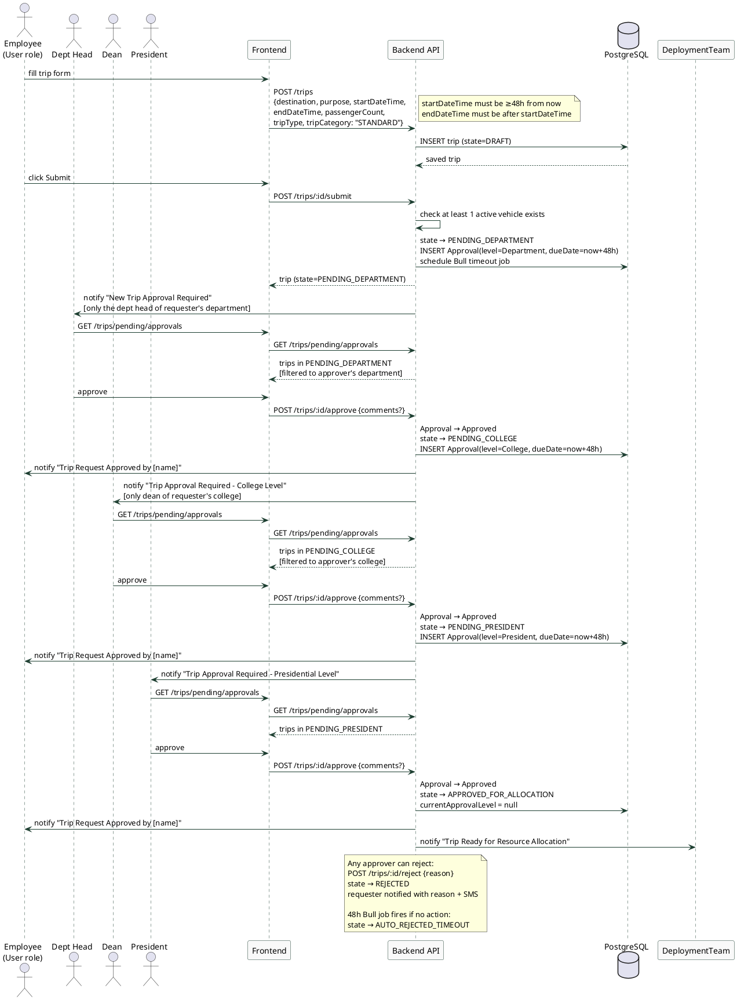
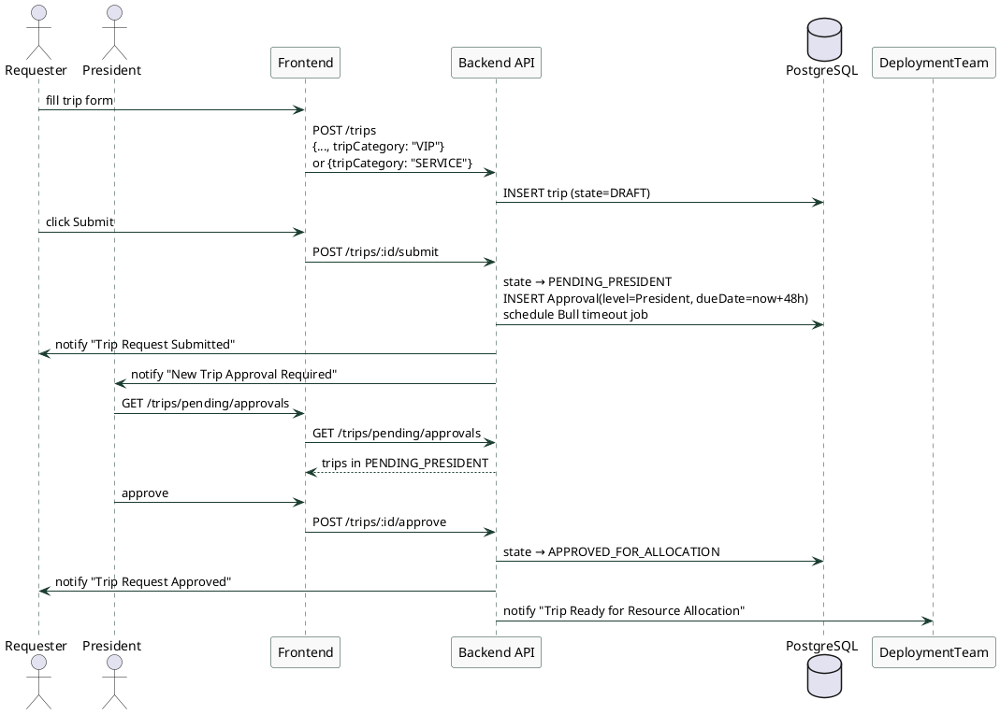
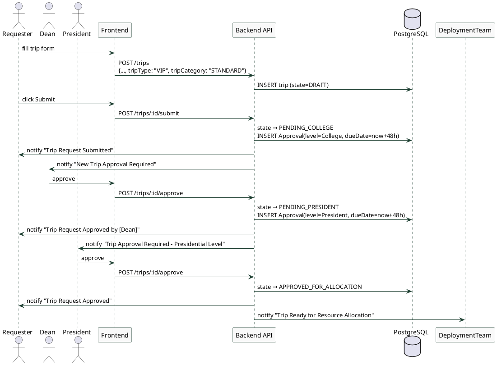
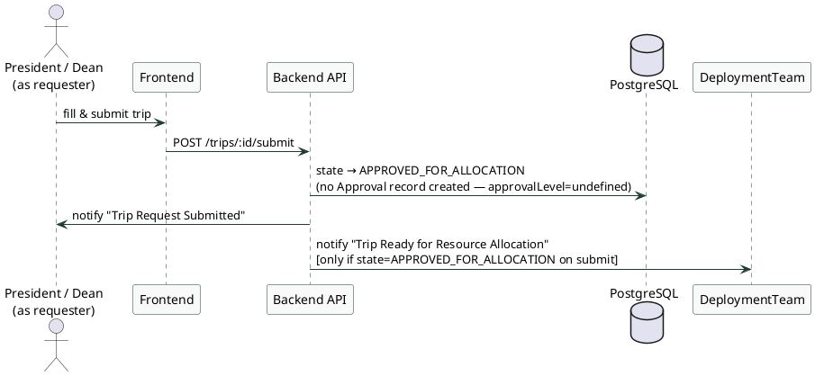
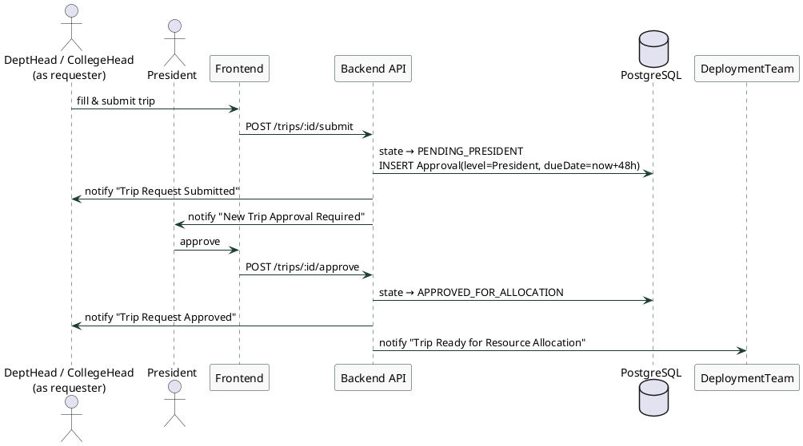
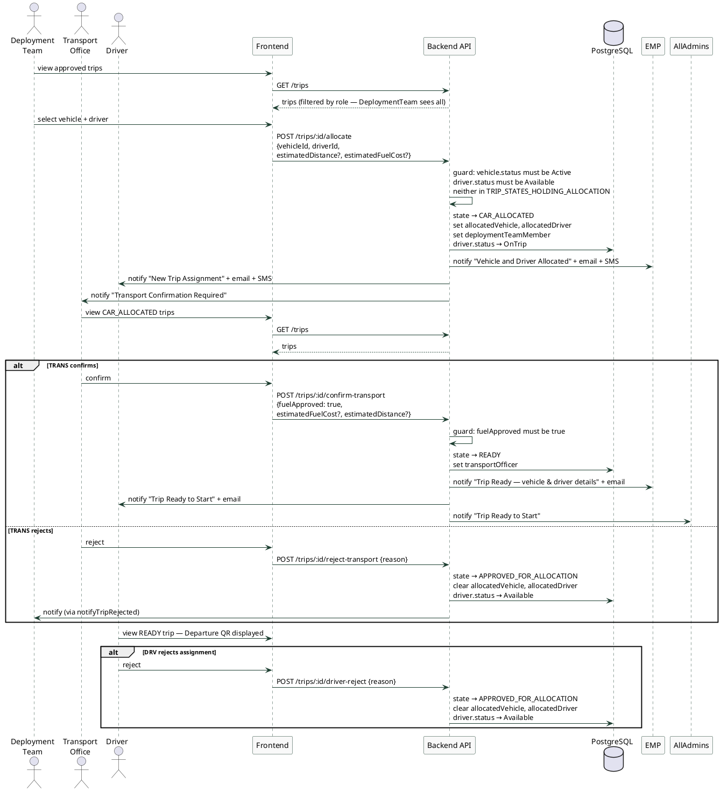
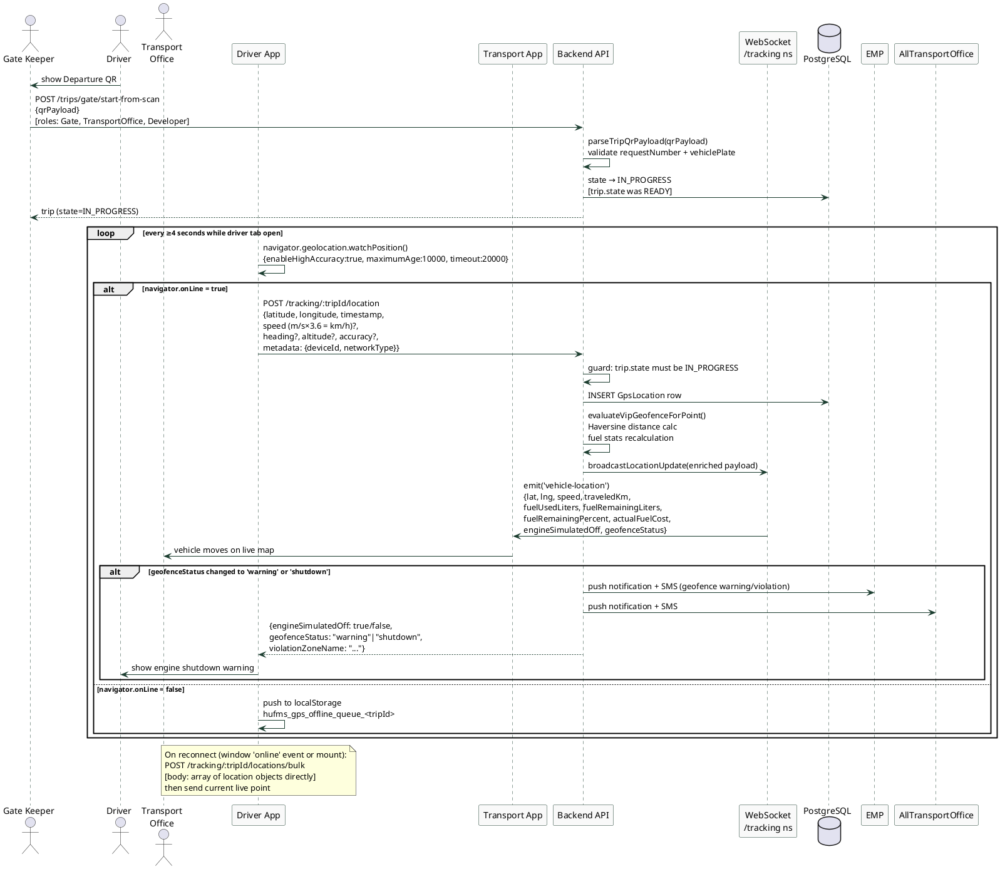
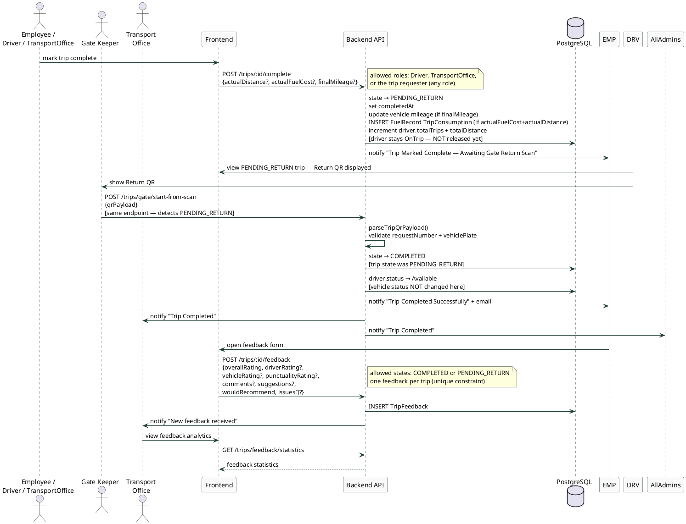

# Fleet Management System — Sequence Diagrams

> Every message, endpoint, state transition, and notification in these diagrams is taken directly from the source code. Nothing is assumed.

---

## 1. Authentication (Login)

**Source:** `auth.service.ts → login()`, `auth.controller.ts`, `api.ts → refreshAccessToken()`

---

## 2. Normal Trip — Full Approval Chain

**Condition:** `tripCategory = STANDARD`, requester role = `User`
**Source:** `trips.service.ts → submit(), approve(), reject()`

---

## 3. VIP / SERVICE Trip — Direct to President

**Condition:** `tripCategory = VIP` OR `tripCategory = SERVICE` (any requester role)
**Source:** `trips.service.ts → submit()` — first `if` branch

---

## 4. Legacy VIP Trip — Starts at Dean Level

**Condition:** `tripType = VIP` AND `tripCategory = STANDARD` (any requester role)
**Source:** `trips.service.ts → submit()` — second `else if` branch

---

## 5. High-Rank Requester — Skips All Approvals

**Condition:** requester role = `President` OR `Dean` (any tripCategory STANDARD)
**Source:** `trips.service.ts → submit()` — third `else if` branch

---

## 6. DeptHead / CollegeHead Requester — Skips to President

**Condition:** requester role = `DepartmentHead` OR `CollegeHead` (tripCategory STANDARD)
**Source:** `trips.service.ts → submit()` — fourth `else if` branch

---

## 7. Allocation & Transport Confirmation

**Source:** `trips.service.ts → allocate(), confirmTransport(), rejectTransport(), driverRejectAssignment()`

---

## 8. GPS Tracking & Live Monitoring

**Source:** `tracking.controller.ts`, `tracking.service.ts`, `gate-scan.controller.ts`, `useDriverGpsTracking.ts`

---

## 9. Trip Completion & Feedback

**Source:** `trips.service.ts → completeTrip(), startTripFromGateScan(), submitFeedback()`

---

## Summary

| # | Diagram | Trigger condition | Initial state after submit |
|---|---------|-------------------|---------------------------|
| 2 | Normal trip | `tripCategory=STANDARD`, requester=`User` | `PENDING_DEPARTMENT` |
| 3 | VIP/Service | `tripCategory=VIP` or `SERVICE` | `PENDING_PRESIDENT` |
| 4 | Legacy VIP | `tripType=VIP`, `tripCategory=STANDARD` | `PENDING_COLLEGE` |
| 5 | High-rank requester | requester=`President` or `Dean` | `APPROVED_FOR_ALLOCATION` |
| 6 | Head requester | requester=`DepartmentHead` or `CollegeHead` | `PENDING_PRESIDENT` |
| 7 | Allocation | after `APPROVED_FOR_ALLOCATION` | `CAR_ALLOCATED` → `READY` |
| 8 | GPS Tracking | after gate departure scan | `IN_PROGRESS` |
| 9 | Completion | after `IN_PROGRESS` | `PENDING_RETURN` → `COMPLETED` |
