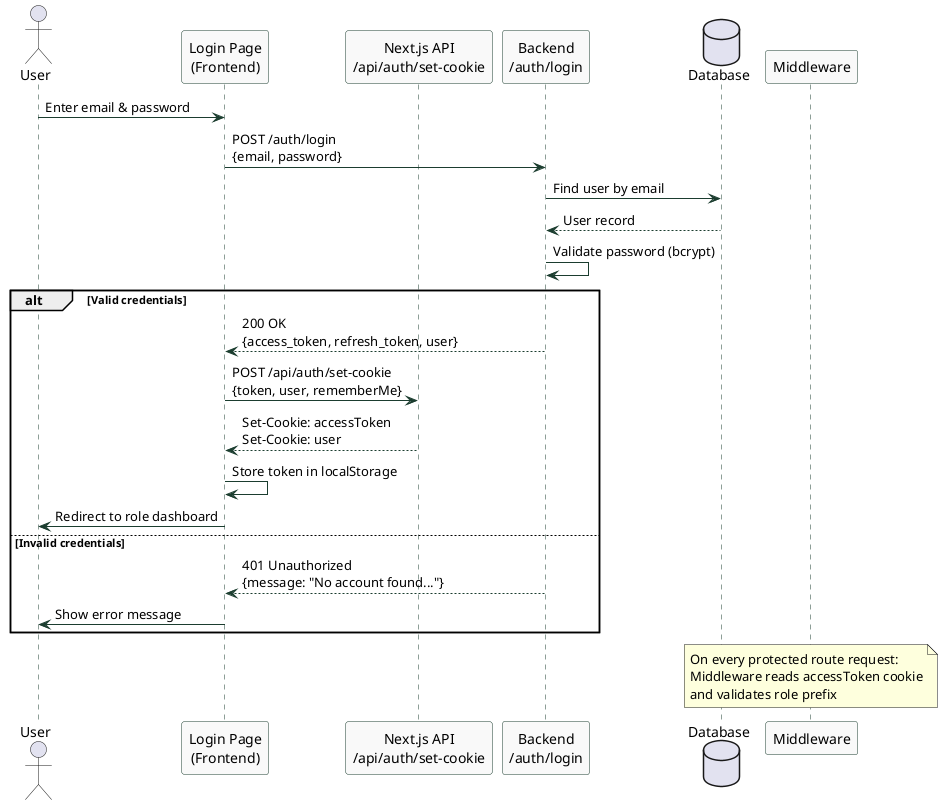
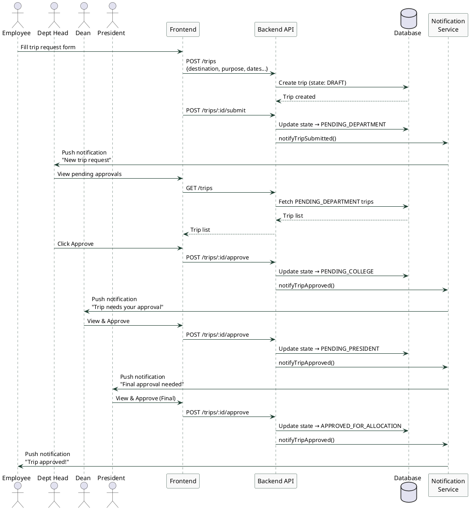
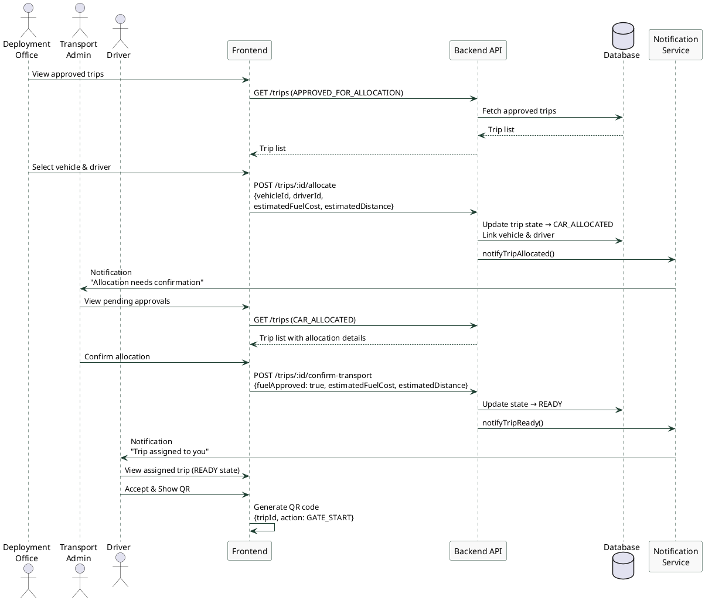
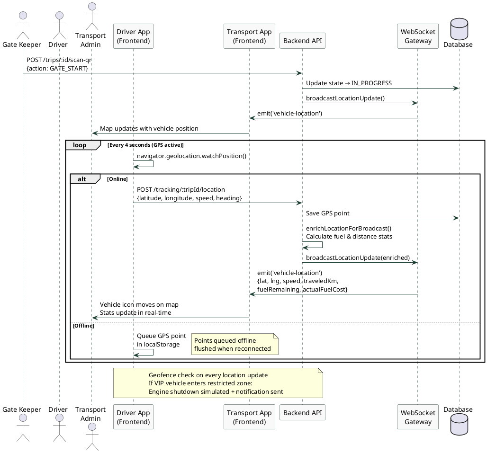
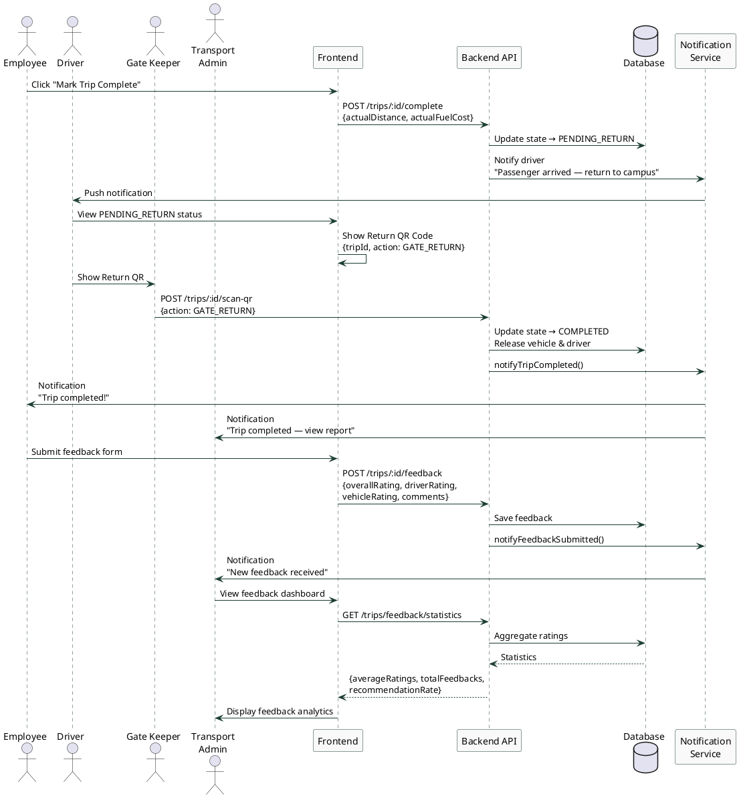

# Fleet Management System — Sequence Diagrams

## Overview

Five sequence diagrams covering the key interactions in the system.

---

## 1. User Authentication (Login)

---

## 2. Trip Request & Multi-Level Approval Flow

---

## 3. Vehicle & Driver Allocation

---

## 4. GPS Tracking & Live Monitoring

---

## 5. Trip Completion & Feedback

---

## Summary Table

| # | Diagram | Actors Involved | Key Message |
|---|---|---|---|
| 1 | Authentication | User, Frontend, Backend, DB | JWT-based login with cookie persistence |
| 2 | Trip Approval | Employee, Dept Head, Dean, President | 4-level approval chain with notifications |
| 3 | Allocation | Deployment Office, Transport Admin, Driver | Vehicle+driver assignment and confirmation |
| 4 | GPS Tracking | Driver, Transport Admin, Gate Keeper | Real-time WebSocket tracking with offline queue |
| 5 | Completion | Employee, Driver, Gate Keeper, Transport Admin | QR-based gate scan + feedback loop |
