# Fleet Management System — Trip State Diagram

> Every transition is taken directly from `trips.service.ts`. No assumptions.

---

## Complete State Diagram

```plantuml
@startuml Trip_State_Diagram

skinparam state {
  BackgroundColor #f9f9f9
  BorderColor #1B3D2F
  ArrowColor #1B3D2F
  StartColor #1B3D2F
  EndColor #1B3D2F
}

[*] --> DRAFT : POST /trips\n[requester, startDateTime ≥ now+48h]

' ══════════════════════════════════════════════
' SUBMIT — 5 routing branches (checked in order)
' ══════════════════════════════════════════════

' Branch 1: tripCategory = VIP or SERVICE
DRAFT --> PENDING_PRESIDENT : submit()\n[tripCategory = VIP or SERVICE]

' Branch 2: tripType = VIP (legacy, tripCategory = STANDARD)
DRAFT --> PENDING_COLLEGE : submit()\n[tripType = VIP, tripCategory = STANDARD]

' Branch 3: requester role = President or Dean
DRAFT --> APPROVED_FOR_ALLOCATION : submit()\n[requester = President or Dean]\n(no Approval record created)

' Branch 4: requester role = DepartmentHead or CollegeHead
DRAFT --> PENDING_PRESIDENT : submit()\n[requester = DepartmentHead or CollegeHead]

' Branch 5: regular User (tripCategory = STANDARD, tripType = Normal)
DRAFT --> PENDING_DEPARTMENT : submit()\n[requester = User, tripCategory = STANDARD]

' DRAFT can also be permanently deleted
DRAFT --> [*] : DELETE /trips/:id\n[requester only]

' ══════════════════════════════════════════════
' APPROVAL CHAIN
' ══════════════════════════════════════════════

PENDING_DEPARTMENT --> PENDING_COLLEGE : approve()\n[DepartmentHead, same dept]
PENDING_DEPARTMENT --> REJECTED : reject()\n[DepartmentHead, same dept]
PENDING_DEPARTMENT --> AUTO_REJECTED_TIMEOUT : 48h Bull job fires\n[no action taken]
PENDING_DEPARTMENT --> CANCELLED : cancel()\n[requester only]

PENDING_COLLEGE --> PENDING_PRESIDENT : approve()\n[Dean, same college]
PENDING_COLLEGE --> REJECTED : reject()\n[Dean, same college]
PENDING_COLLEGE --> AUTO_REJECTED_TIMEOUT : 48h Bull job fires
PENDING_COLLEGE --> CANCELLED : cancel()\n[requester only]

PENDING_PRESIDENT --> APPROVED_FOR_ALLOCATION : approve()\n[President]
PENDING_PRESIDENT --> REJECTED : reject()\n[President]
PENDING_PRESIDENT --> AUTO_REJECTED_TIMEOUT : 48h Bull job fires
PENDING_PRESIDENT --> CANCELLED : cancel()\n[requester only]

' ══════════════════════════════════════════════
' ALLOCATION
' ══════════════════════════════════════════════

APPROVED_FOR_ALLOCATION --> CAR_ALLOCATED : allocate()\n[DeploymentTeam only]\n[vehicle.status ≠ Maintenance]\n[vehicle + driver not in active trip]\ndriver.status → OnTrip
APPROVED_FOR_ALLOCATION --> CANCELLED : cancel()\n[requester only]

' ══════════════════════════════════════════════
' TRANSPORT CONFIRMATION
' ══════════════════════════════════════════════

CAR_ALLOCATED --> READY : confirmTransport()\n[TransportOffice only]\n[fuelApproved = true]\nCAR_ALLOCATED → READY (direct)
CAR_ALLOCATED --> APPROVED_FOR_ALLOCATION : rejectTransport()\n[TransportOffice only]\nvehicle + driver cleared\ndriver.status → Available
CAR_ALLOCATED --> CANCELLED : cancel()\n[requester only]

' ══════════════════════════════════════════════
' DRIVER REJECTS ASSIGNMENT
' ══════════════════════════════════════════════

READY --> APPROVED_FOR_ALLOCATION : driverRejectAssignment()\n[assigned driver only]\nvehicle + driver cleared\ndriver.status → Available
CAR_ALLOCATED --> APPROVED_FOR_ALLOCATION : driverRejectAssignment()\n[assigned driver only]\nvehicle + driver cleared\ndriver.status → Available

READY --> CANCELLED : cancel()\n[requester only]

' ══════════════════════════════════════════════
' TRIP EXECUTION — Gate departure scan
' ══════════════════════════════════════════════

READY --> IN_PROGRESS : startTripFromGateScan()\n[Gate / TransportOffice / Developer]\nPOST /trips/gate/start-from-scan\n[validates QR requestNumber + vehiclePlate]

' Also: startTrip() via POST /trips/:id/start
' [Driver or TransportOffice, requires plateNumber in body]
READY --> IN_PROGRESS : startTrip()\n[Driver or TransportOffice]\nPOST /trips/:id/start\n[requires plateNumber match]

' ══════════════════════════════════════════════
' TRIP COMPLETION PATHS
' ══════════════════════════════════════════════

' Path A: normal completion — marks PENDING_RETURN, gate must scan return
IN_PROGRESS --> PENDING_RETURN : completeTrip()\n[Driver, TransportOffice, or requester]\nPOST /trips/:id/complete\ndriver stays OnTrip

' Path B: early completion by admin — goes directly to COMPLETED
IN_PROGRESS --> COMPLETED : completeEarly()\n[TransportOffice or DeploymentTeam only]\nPOST /trips/:id/complete-early\n[only before scheduled endDateTime]

' Path C: requester early completion — goes directly to COMPLETED
IN_PROGRESS --> COMPLETED : requesterCompleteTrip()\n[requester only]\nPOST /trips/:id/requester-complete\n[only before scheduled endDateTime]\ndriver.status → Available

' Gate scans return QR → final completion
PENDING_RETURN --> COMPLETED : startTripFromGateScan()\n[Gate / TransportOffice / Developer]\nPOST /trips/gate/start-from-scan\n[detects PENDING_RETURN state]\ndriver.status → Available

' ══════════════════════════════════════════════
' TERMINAL STATES
' ══════════════════════════════════════════════

COMPLETED --> [*]
REJECTED --> [*]
AUTO_REJECTED_TIMEOUT --> [*]
CANCELLED --> [*]

note right of CAR_ALLOCATED
  TRIP_STATES_HOLDING_ALLOCATION:
  CAR_ALLOCATED, READY,
  IN_PROGRESS, PENDING_RETURN
  Vehicle + driver locked in all these states
end note

note right of IN_PROGRESS
  GPS tracking active
  POST /tracking/:tripId/location
  every ≥4 seconds
  Geofence evaluated per point
end note

note right of PENDING_RETURN
  Driver status stays OnTrip
  Vehicle mileage already updated
  FuelRecord already created
  Waiting for gate return scan
end note

@enduml
```

---

## All Transitions — Complete Reference

| From | To | Method | Actor | Guard |
|------|----|--------|-------|-------|
| `[new]` | `DRAFT` | `create()` | Any authenticated user | `startDateTime ≥ now+48h`, `endDateTime > startDateTime` |
| `DRAFT` | `PENDING_PRESIDENT` | `submit()` | Requester | `tripCategory = VIP or SERVICE` |
| `DRAFT` | `PENDING_COLLEGE` | `submit()` | Requester | `tripType = VIP` AND `tripCategory = STANDARD` |
| `DRAFT` | `APPROVED_FOR_ALLOCATION` | `submit()` | Requester | `requesterRole = President or Dean` |
| `DRAFT` | `PENDING_PRESIDENT` | `submit()` | Requester | `requesterRole = DepartmentHead or CollegeHead` |
| `DRAFT` | `PENDING_DEPARTMENT` | `submit()` | Requester | `requesterRole = User`, `tripCategory = STANDARD`, `tripType = Normal` |
| `DRAFT` | _(deleted)_ | `remove()` | Requester only | Must be DRAFT |
| `PENDING_DEPARTMENT` | `PENDING_COLLEGE` | `approve()` | DepartmentHead | Same department as requester |
| `PENDING_DEPARTMENT` | `REJECTED` | `reject()` | DepartmentHead | Same department as requester |
| `PENDING_DEPARTMENT` | `AUTO_REJECTED_TIMEOUT` | Bull job | System | 48h elapsed with no action |
| `PENDING_DEPARTMENT` | `CANCELLED` | `cancel()` | Requester only | — |
| `PENDING_COLLEGE` | `PENDING_PRESIDENT` | `approve()` | Dean | Same college as requester |
| `PENDING_COLLEGE` | `REJECTED` | `reject()` | Dean | Same college as requester |
| `PENDING_COLLEGE` | `AUTO_REJECTED_TIMEOUT` | Bull job | System | 48h elapsed |
| `PENDING_COLLEGE` | `CANCELLED` | `cancel()` | Requester only | — |
| `PENDING_PRESIDENT` | `APPROVED_FOR_ALLOCATION` | `approve()` | President | — |
| `PENDING_PRESIDENT` | `REJECTED` | `reject()` | President | — |
| `PENDING_PRESIDENT` | `AUTO_REJECTED_TIMEOUT` | Bull job | System | 48h elapsed |
| `PENDING_PRESIDENT` | `CANCELLED` | `cancel()` | Requester only | — |
| `APPROVED_FOR_ALLOCATION` | `CAR_ALLOCATED` | `allocate()` | DeploymentTeam only | `vehicle.status ≠ Maintenance`, vehicle + driver not in `TRIP_STATES_HOLDING_ALLOCATION` |
| `APPROVED_FOR_ALLOCATION` | `CANCELLED` | `cancel()` | Requester only | — |
| `CAR_ALLOCATED` | `READY` | `confirmTransport()` | TransportOffice only | `fuelApproved = true` |
| `CAR_ALLOCATED` | `APPROVED_FOR_ALLOCATION` | `rejectTransport()` | TransportOffice only | Clears vehicle + driver, driver → Available |
| `CAR_ALLOCATED` | `APPROVED_FOR_ALLOCATION` | `driverRejectAssignment()` | Assigned driver only | Clears vehicle + driver, driver → Available |
| `CAR_ALLOCATED` | `CANCELLED` | `cancel()` | Requester only | — |
| `READY` | `IN_PROGRESS` | `startTripFromGateScan()` | Gate / TransportOffice / Developer | Valid QR, `requestNumber` + `vehiclePlate` match |
| `READY` | `IN_PROGRESS` | `startTrip()` | Driver or TransportOffice | `plateNumber` in body must match `allocatedVehicle.plateNumber` |
| `READY` | `APPROVED_FOR_ALLOCATION` | `driverRejectAssignment()` | Assigned driver only | Clears vehicle + driver, driver → Available |
| `READY` | `CANCELLED` | `cancel()` | Requester only | — |
| `IN_PROGRESS` | `PENDING_RETURN` | `completeTrip()` | Driver, TransportOffice, or requester | Driver stays `OnTrip` |
| `IN_PROGRESS` | `COMPLETED` | `completeEarly()` | TransportOffice or DeploymentTeam only | `now < endDateTime` |
| `IN_PROGRESS` | `COMPLETED` | `requesterCompleteTrip()` | Requester only | `now < endDateTime`, driver → Available |
| `PENDING_RETURN` | `COMPLETED` | `startTripFromGateScan()` | Gate / TransportOffice / Developer | Valid QR, detects `PENDING_RETURN` state, driver → Available |

## Notes

- `PENDING_TRANSPORT_CONFIRM` is defined in the `TripState` enum but **never assigned** by any service method. `confirmTransport()` goes directly `CAR_ALLOCATED → READY`.
- `TRIP_STATES_HOLDING_ALLOCATION = [CAR_ALLOCATED, READY, IN_PROGRESS, PENDING_RETURN]` — vehicle and driver are locked in all four states.
- `cancel()` blocks on: `COMPLETED`, `CANCELLED`, `REJECTED`, `AUTO_REJECTED_TIMEOUT`, and `IN_PROGRESS`.
- `completeEarly()` and `requesterCompleteTrip()` both require `now < endDateTime` — they fail if the scheduled end time has already passed.
- On `requesterCompleteTrip()` the driver is released immediately (`Available`). On `completeTrip()` the driver stays `OnTrip` until the gate scans the return QR.
