# Fleet Management System - Use Case Diagram

## Complete System with All Actors

```mermaid
graph TB
    subgraph "Fleet Management System"
        subgraph "Authentication & Profile"
            UC1[Login]
            UC2[Logout]
            UC3[Update Profile]
            UC4[Change Password]
            UC5[Upload Profile Picture]
            UC6[Forgot Password]
            UC7[Reset Password]
        end
        
        subgraph "Trip Management"
            UC8[Request Trip]
            UC9[View Trip Details]
            UC10[Approve - Department]
            UC11[Approve - College]
            UC12[Approve - Dean]
            UC13[Approve - President]
            UC14[Reject Trip]
            UC15[Cancel Trip]
            UC16[Provide Feedback]
            UC17[Log Trip]
        end
        
        subgraph "Resource Allocation"
            UC18[Allocate Vehicle]
            UC19[Check Availability]
            UC20[Check Condition]
        end
        
        subgraph "Vehicle Management"
            UC21[Manage Fleet]
            UC22[Inspect]
            UC23[View Details]
        end
        
        subgraph "Driver Management"
            UC24[Manage Drivers]
        end
        
        subgraph "Maintenance"
            UC25[Request Maintenance]
            UC26[Process Maintenance]
            UC27[Approve Maintenance Budget]
        end
        
        subgraph "User Management"
            UC28[Create User]
            UC29[Security]
        end
        
        subgraph "Gate Operations"
            UC30[Scan Trip QR]
            UC31[Verify Trip Start]
        end
        
        subgraph "Development"
            UC32[System Development]
            UC33[Debug]
            UC34[Deploy]
        end
    end
    
    %% All 12 Actors from UserRole enum
    Employee((Employee<br/>User))
    DeptHead((Department<br/>Head))
    CollegeHead((College<br/>Head))
    Dean((Dean))
    President((President))
    DeploymentTeam((Deployment<br/>Team))
    TransportOffice((Transport<br/>Office))
    MaintenanceTeam((Maintenance<br/>Team))
    Driver((Driver))
    Gate((Gate/<br/>Security))
    Developer((Developer))
    SystemAdmin((System<br/>Admin))
    
    %% Employee (User) Use Cases
    Employee --> UC1
    Employee --> UC2
    Employee --> UC3
    Employee --> UC4
    Employee --> UC5
    Employee --> UC6
    Employee --> UC7
    Employee --> UC8
    Employee --> UC9
    Employee --> UC15
    Employee --> UC16
    Employee --> UC23
    
    %% Department Head Use Cases
    DeptHead --> UC1
    DeptHead --> UC2
    DeptHead --> UC3
    DeptHead --> UC4
    DeptHead --> UC9
    DeptHead --> UC10
    DeptHead --> UC14
    
    %% College Head Use Cases
    CollegeHead --> UC1
    CollegeHead --> UC2
    CollegeHead --> UC3
    CollegeHead --> UC4
    CollegeHead --> UC9
    CollegeHead --> UC11
    CollegeHead --> UC14
    
    %% Dean Use Cases
    Dean --> UC1
    Dean --> UC2
    Dean --> UC3
    Dean --> UC4
    Dean --> UC9
    Dean --> UC12
    Dean --> UC14
    Dean --> UC27
    
    %% President Use Cases
    President --> UC1
    President --> UC2
    President --> UC3
    President --> UC4
    President --> UC9
    President --> UC13
    President --> UC14
    President --> UC27
    
    %% Deployment Team Use Cases
    DeploymentTeam --> UC1
    DeploymentTeam --> UC2
    DeploymentTeam --> UC3
    DeploymentTeam --> UC4
    DeploymentTeam --> UC9
    DeploymentTeam --> UC18
    DeploymentTeam --> UC19
    DeploymentTeam --> UC20
    DeploymentTeam --> UC21
    DeploymentTeam --> UC23
    DeploymentTeam --> UC24
    DeploymentTeam --> UC25
    DeploymentTeam --> UC26
    
    %% Transport Office Use Cases
    TransportOffice --> UC1
    TransportOffice --> UC2
    TransportOffice --> UC3
    TransportOffice --> UC4
    TransportOffice --> UC9
    TransportOffice --> UC18
    TransportOffice --> UC19
    TransportOffice --> UC21
    TransportOffice --> UC22
    TransportOffice --> UC23
    TransportOffice --> UC24
    
    %% Maintenance Team Use Cases
    MaintenanceTeam --> UC1
    MaintenanceTeam --> UC2
    MaintenanceTeam --> UC3
    MaintenanceTeam --> UC4
    MaintenanceTeam --> UC20
    MaintenanceTeam --> UC22
    MaintenanceTeam --> UC25
    MaintenanceTeam --> UC26
    
    %% Driver Use Cases
    Driver --> UC1
    Driver --> UC2
    Driver --> UC3
    Driver --> UC4
    Driver --> UC9
    Driver --> UC17
    Driver --> UC25
    
    %% Gate/Security Use Cases
    Gate --> UC1
    Gate --> UC2
    Gate --> UC30
    Gate --> UC31
    
    %% Developer Use Cases
    Developer --> UC1
    Developer --> UC2
    Developer --> UC32
    Developer --> UC33
    Developer --> UC34
    
    %% System Admin Use Cases
    SystemAdmin --> UC1
    SystemAdmin --> UC2
    SystemAdmin --> UC3
    SystemAdmin --> UC4
    SystemAdmin --> UC28
    SystemAdmin --> UC29
    
    style Employee fill:#e1f5ff
    style DeptHead fill:#fff4e1
    style CollegeHead fill:#ffe1f5
    style Dean fill:#f5e1ff
    style President fill:#e1ffe1
    style DeploymentTeam fill:#ffe1e1
    style TransportOffice fill:#f5ffe1
    style MaintenanceTeam fill:#e1e1ff
    style Driver fill:#ffe1e1
    style Gate fill:#f5f5e1
    style Developer fill:#e1fff5
    style SystemAdmin fill:#ffe1ff
```



---

## Complete Actor Descriptions (All 12 Roles)

### 1. Employee (User)
**Role**: University staff/faculty who request transportation for official business

**Primary Use Cases**:
- Login/Logout
- Request trips
- View trip details and status
- Cancel pending trips
- Provide feedback after trip completion
- Update profile and change password
- Upload profile picture
- Password recovery

**Access Level**: Basic user - can only manage own trip requests

---

### 2. Department Head
**Role**: First-level approver for trips from their department

**Primary Use Cases**:
- Login/Logout
- View trip details from department
- Approve trips at department level
- Reject trips with reason
- Update profile

**Access Level**: Department-level approval authority

---

### 3. College Head
**Role**: Second-level approver for trips from their college

**Primary Use Cases**:
- Login/Logout
- View trip details from college
- Approve trips at college level
- Reject trips with reason
- Update profile

**Access Level**: College-level approval authority

---

### 4. Dean
**Role**: Third-level approver (Dean level) for trips

**Primary Use Cases**:
- Login/Logout
- View trip details
- Approve trips at dean level
- Reject trips with reason
- Approve maintenance budgets
- Update profile

**Access Level**: Dean-level approval authority with budget approval

---

### 5. President
**Role**: Final approver for all university trips (highest authority)

**Primary Use Cases**:
- Login/Logout
- View trip details
- Approve trips at presidential level (final approval)
- Reject trips with reason
- Approve major maintenance budgets
- Update profile

**Access Level**: Presidential approval authority - final decision maker

---

### 6. Deployment Team
**Role**: Operations team that manages fleet deployment and maintenance

**Primary Use Cases**:
- Login/Logout
- View trip details
- Allocate vehicles to approved trips
- Check vehicle availability
- Check vehicle condition
- Manage fleet (vehicles)
- Manage drivers
- Request maintenance
- Process maintenance requests
- Update profile

**Access Level**: Fleet operations and maintenance management

---

### 7. Transport Office
**Role**: Transport office staff managing vehicle allocation and inspections

**Primary Use Cases**:
- Login/Logout
- View trip details
- Allocate vehicles to trips
- Check vehicle availability
- Manage fleet
- Inspect vehicles
- View vehicle details
- Manage drivers
- Update profile

**Access Level**: Vehicle allocation and inspection authority

---

### 8. Maintenance Team
**Role**: Team responsible for vehicle maintenance and repairs

**Primary Use Cases**:
- Login/Logout
- Check vehicle condition
- Inspect vehicles
- Request maintenance
- Process maintenance work
- Update profile

**Access Level**: Maintenance operations and vehicle inspection

---

### 9. Driver
**Role**: Drivers who execute assigned trips

**Primary Use Cases**:
- Login/Logout
- View trip details (assigned trips)
- Log trip (start, update, complete)
- Request maintenance for vehicle issues
- Update profile

**Access Level**: Trip execution and vehicle issue reporting

---

### 10. Gate (Security)
**Role**: Gate/security personnel who verify trip starts

**Primary Use Cases**:
- Login/Logout
- Scan trip QR code
- Verify trip start authorization

**Access Level**: Trip verification at gate/entry points

---

### 11. Developer
**Role**: System developers with full system access

**Primary Use Cases**:
- Login/Logout
- System development
- Debug system issues
- Deploy system updates

**Access Level**: Full system access for development and debugging

---

### 12. System Admin
**Role**: System administrator managing users and security

**Primary Use Cases**:
- Login/Logout
- Create user accounts
- Manage user security and roles
- Update profile

**Access Level**: User management and system security administration

---

## Use Case Summary by Category

### Authentication & Profile (7 use cases)
- Login
- Logout
- Update Profile
- Change Password
- Upload Profile Picture
- Forgot Password
- Reset Password

### Trip Management (10 use cases)
- Request Trip
- View Trip Details
- Approve - Department
- Approve - College
- Approve - Dean
- Approve - President
- Reject Trip
- Cancel Trip
- Provide Feedback
- Log Trip

### Resource Allocation (3 use cases)
- Allocate Vehicle
- Check Availability
- Check Condition

### Vehicle Management (3 use cases)
- Manage Fleet
- Inspect
- View Details

### Driver Management (1 use case)
- Manage Drivers

### Maintenance (3 use cases)
- Request Maintenance
- Process Maintenance
- Approve Maintenance Budget

### User Management (2 use cases)
- Create User
- Security

### Gate Operations (2 use cases)
- Scan Trip QR
- Verify Trip Start

### Development (3 use cases)
- System Development
- Debug
- Deploy

---

## Approval Workflow Hierarchy

The system implements a multi-level approval workflow:

```
Employee (User)
    ↓ submits trip
Department Head
    ↓ approves
College Head
    ↓ approves
Dean
    ↓ approves
President
    ↓ final approval
Deployment Team / Transport Office
    ↓ allocates resources
Driver
    ↓ executes trip
Gate (Security)
    ↓ verifies at gate
```

---

## Actor Hierarchy and Relationships

### Approval Chain
1. **Employee** → Creates trip request
2. **Department Head** → First approval
3. **College Head** → Second approval
4. **Dean** → Third approval
5. **President** → Final approval

### Operations Chain
6. **Deployment Team** → Allocates resources
7. **Transport Office** → Manages allocation
8. **Driver** → Executes trip
9. **Gate** → Verifies at entry/exit

### Support Roles
10. **Maintenance Team** → Maintains vehicles
11. **System Admin** → Manages users
12. **Developer** → Develops system

---

## Total Statistics

- **Total Actors**: 12 (all UserRole enum values)
- **Total Use Cases**: 34 (simplified from 72)
- **Approval Levels**: 4 (Department → College → Dean → President)
- **Operational Roles**: 5 (Deployment, Transport, Driver, Gate, Maintenance)
- **Administrative Roles**: 2 (System Admin, Developer)

---

## Key Differences from Original 8-Actor Model

### Additional Actors (4 new)
1. **College Head** - Separate from Dean for college-level approval
2. **Dean** - Distinct dean-level approval with budget authority
3. **Gate (Security)** - QR code scanning and trip verification
4. **Developer** - System development and maintenance

### Role Clarifications
- **Deployment Team** - Replaces "Deployment Office" for operations
- **Transport Office** - Replaces "Transport Admin" for consistency
- **Maintenance Team** - Explicit maintenance role
- **Employee (User)** - Clarified as base user role

---

## Access Control Matrix

| Actor | Trip Mgmt | Approval | Fleet Mgmt | Maintenance | User Mgmt | Development | Gate Ops |
|-------|-----------|----------|------------|-------------|-----------|-------------|----------|
| Employee | ✓ (own) | ✗ | ✗ | ✗ | ✗ | ✗ | ✗ |
| Dept Head | ✓ (view) | ✓ (dept) | ✗ | ✗ | ✗ | ✗ | ✗ |
| College Head | ✓ (view) | ✓ (college) | ✗ | ✗ | ✗ | ✗ | ✗ |
| Dean | ✓ (view) | ✓ (dean) | ✗ | ✓ (budget) | ✗ | ✗ | ✗ |
| President | ✓ (view) | ✓ (final) | ✗ | ✓ (budget) | ✗ | ✗ | ✗ |
| Deployment | ✓ (all) | ✗ | ✓ | ✓ | ✗ | ✗ | ✗ |
| Transport | ✓ (all) | ✗ | ✓ | ✗ | ✗ | ✗ | ✗ |
| Maintenance | ✗ | ✗ | ✓ (inspect) | ✓ | ✗ | ✗ | ✗ |
| Driver | ✓ (assigned) | ✗ | ✗ | ✓ (request) | ✗ | ✗ | ✗ |
| Gate | ✓ (verify) | ✗ | ✗ | ✗ | ✗ | ✗ | ✓ |
| Developer | ✓ (all) | ✓ (all) | ✓ (all) | ✓ (all) | ✓ (all) | ✓ | ✓ |
| System Admin | ✗ | ✗ | ✗ | ✗ | ✓ | ✗ | ✗ |

---

## Integration Points

### External Systems
- Email service (notifications, password recovery)
- SMS service (optional notifications)
- GPS tracking (vehicle location)
- QR code system (gate verification)

### Internal Systems
- Authentication service (JWT-based)
- Notification service (real-time push)
- Audit logging service
- Workflow engine (approval automation)

---

## Security Considerations

### Role-Based Access Control (RBAC)
- Each actor has specific permissions
- Department/college-level data isolation
- Hierarchical approval enforcement

### Authentication
- JWT-based authentication
- Token blacklisting on logout
- Password recovery workflow
- Multi-factor authentication (optional)

### Audit Trail
- Complete audit logging
- User action tracking
- System change monitoring

---

## Notes

This updated use case diagram represents the complete Fleet Management System with all 12 actors from the UserRole enum. The system supports:

1. **Multi-level approval workflow** (4 levels: Department → College → Dean → President)
2. **Comprehensive fleet operations** (Deployment Team, Transport Office, Maintenance Team)
3. **Trip execution and verification** (Driver, Gate/Security)
4. **System administration** (System Admin, Developer)
5. **Role-based access control** for all 12 actor types
6. **Complete audit trail** for compliance
7. **QR code integration** for gate verification
8. **Flexible workflow** supporting different trip types

The system is designed to handle the complete lifecycle of university fleet management from trip request through multiple approval levels to execution, with appropriate oversight and verification at each stage.
