# Fleet Management System — Use Case Diagram

## Actors (9)

| # | Actor | Description |
|---|-------|-------------|
| 1 | Employee | University staff who request transportation |
| 2 | Department Head | First-level trip approver |
| 3 | Dean / College Head | Second-level trip approver |
| 4 | President | Final trip approver |
| 5 | Deployment Office | Allocates vehicle and driver to approved trips |
| 6 | Transport Admin | Confirms allocation, manages fleet, drivers, live tracking |
| 7 | Driver | Executes assigned trips, reports maintenance |
| 8 | System Admin | Manages users, system config, audit logs |
| 9 | Gate Keeper | Scans QR at departure and return to start/complete trip |

---

## Use Case Diagram

```plantuml
@startuml Fleet_Management_System_Use_Case

left to right direction
skinparam actorStyle awesome
skinparam packageStyle rectangle
skinparam usecase {
  BackgroundColor #f9f9f9
  BorderColor #1B3D2F
  ArrowColor #1B3D2F
}

' ── Actors ──────────────────────────────────────────────
actor "Employee"          as EMP
actor "Department Head"   as DEPT
actor "Dean/College Head" as DEAN
actor "President"         as PRES
actor "Deployment Office" as DEPLOY
actor "Transport Admin"   as TRANS
actor "Driver"            as DRV
actor "System Admin"      as SADMIN
actor "Gate Keeper"       as GATE

' ── System Boundary ─────────────────────────────────────
rectangle "Fleet Management System" {

  ' Authentication (shared)
  usecase "Login"               as UC_LOGIN
  usecase "Logout"              as UC_LOGOUT
  usecase "Forgot Password"     as UC_FORGOT
  usecase "Reset Password"      as UC_RESET
  usecase "Update Profile"      as UC_PROFILE
  usecase "Change Password"     as UC_CHPWD

  ' Employee use cases
  usecase "Submit Trip Request"   as UC_SUBMIT
  usecase "View Trip Status"      as UC_STATUS
  usecase "Cancel Trip"           as UC_CANCEL
  usecase "Mark Trip Complete"    as UC_MARKCOMPLETE
  usecase "Provide Trip Feedback" as UC_FEEDBACK
  usecase "Receive Notification"  as UC_NOTIF

  ' Approval use cases
  usecase "View Pending Approvals"    as UC_PENDING
  usecase "Approve Trip"              as UC_APPROVE
  usecase "Reject Trip"               as UC_REJECT

  ' Deployment Office use cases
  usecase "Allocate Vehicle & Driver"  as UC_ALLOC
  usecase "Check Vehicle Availability" as UC_AVAIL
  usecase "Check Driver Availability"  as UC_DRVAVAIL

  ' Transport Admin use cases
  usecase "Confirm Transport Allocation" as UC_CONFIRM
  usecase "Reject Allocation"            as UC_REJALLOC
  usecase "Manage Vehicles"              as UC_VEHICLES
  usecase "Manage Drivers"               as UC_DRIVERS
  usecase "Assign Vehicle to Driver"     as UC_ASSIGNVEH
  usecase "Live Trip Tracking"           as UC_TRACK
  usecase "View Fuel Reports"            as UC_FUEL
  usecase "Generate Reports"             as UC_REPORTS

  ' Driver use cases
  usecase "View Assigned Trip"       as UC_VIEWTRIP
  usecase "Accept Trip Assignment"   as UC_ACCEPT
  usecase "Reject Trip Assignment"   as UC_REJECTTRIP
  usecase "Show Departure QR"        as UC_DEPQR
  usecase "Show Return QR"           as UC_RETQR
  usecase "Report Maintenance Issue" as UC_MAINT

  ' Gate Keeper use cases
  usecase "Scan Departure QR" as UC_SCANDEP
  usecase "Scan Return QR"    as UC_SCANRET
  usecase "Start Trip"        as UC_START
  usecase "Complete Trip"     as UC_COMPLETE

  ' System Admin use cases
  usecase "Manage Users"           as UC_USERS
  usecase "View Audit Logs"        as UC_AUDIT
  usecase "System Configuration"   as UC_CONFIG
  usecase "Broadcast Notification" as UC_BROADCAST

  ' ── Include Relations ──────────────────────────────────
  UC_SUBMIT       ..> UC_LOGIN     : <<include>>
  UC_APPROVE      ..> UC_PENDING   : <<include>>
  UC_ALLOC        ..> UC_AVAIL     : <<include>>
  UC_ALLOC        ..> UC_DRVAVAIL  : <<include>>
  UC_CONFIRM      ..> UC_ALLOC     : <<include>>
  UC_ACCEPT       ..> UC_DEPQR     : <<include>>
  UC_SCANDEP      ..> UC_START     : <<include>>
  UC_SCANRET      ..> UC_COMPLETE  : <<include>>
  UC_FORGOT       ..> UC_RESET     : <<include>>
  UC_ASSIGNVEH    ..> UC_DRIVERS   : <<include>>
  UC_MARKCOMPLETE ..> UC_RETQR     : <<include>>

  ' ── Extend Relations ───────────────────────────────────
  UC_NOTIF    ..> UC_APPROVE      : <<extend>>
  UC_NOTIF    ..> UC_REJECT       : <<extend>>
  UC_NOTIF    ..> UC_ALLOC        : <<extend>>
  UC_NOTIF    ..> UC_CONFIRM      : <<extend>>
  UC_NOTIF    ..> UC_ACCEPT       : <<extend>>
  UC_NOTIF    ..> UC_START        : <<extend>>
  UC_NOTIF    ..> UC_COMPLETE     : <<extend>>
  UC_FEEDBACK ..> UC_COMPLETE     : <<extend>>
  UC_TRACK    ..> UC_START        : <<extend>>
  UC_FUEL     ..> UC_COMPLETE     : <<extend>>
}

' ── Employee ─────────────────────────────────────────────
EMP --> UC_LOGIN
EMP --> UC_LOGOUT
EMP --> UC_FORGOT
EMP --> UC_PROFILE
EMP --> UC_CHPWD
EMP --> UC_SUBMIT
EMP --> UC_STATUS
EMP --> UC_CANCEL
EMP --> UC_MARKCOMPLETE
EMP --> UC_FEEDBACK
EMP --> UC_NOTIF

' ── Department Head ──────────────────────────────────────
DEPT --> UC_LOGIN
DEPT --> UC_LOGOUT
DEPT --> UC_PROFILE
DEPT --> UC_PENDING
DEPT --> UC_APPROVE
DEPT --> UC_REJECT
DEPT --> UC_STATUS
DEPT --> UC_NOTIF

' ── Dean / College Head ──────────────────────────────────
DEAN --> UC_LOGIN
DEAN --> UC_LOGOUT
DEAN --> UC_PROFILE
DEAN --> UC_PENDING
DEAN --> UC_APPROVE
DEAN --> UC_REJECT
DEAN --> UC_STATUS
DEAN --> UC_NOTIF

' ── President ────────────────────────────────────────────
PRES --> UC_LOGIN
PRES --> UC_LOGOUT
PRES --> UC_PROFILE
PRES --> UC_PENDING
PRES --> UC_APPROVE
PRES --> UC_REJECT
PRES --> UC_STATUS
PRES --> UC_NOTIF
PRES --> UC_REPORTS

' ── Deployment Office ────────────────────────────────────
DEPLOY --> UC_LOGIN
DEPLOY --> UC_LOGOUT
DEPLOY --> UC_PROFILE
DEPLOY --> UC_ALLOC
DEPLOY --> UC_AVAIL
DEPLOY --> UC_DRVAVAIL
DEPLOY --> UC_STATUS
DEPLOY --> UC_NOTIF

' ── Transport Admin ──────────────────────────────────────
TRANS --> UC_LOGIN
TRANS --> UC_LOGOUT
TRANS --> UC_PROFILE
TRANS --> UC_CONFIRM
TRANS --> UC_REJALLOC
TRANS --> UC_VEHICLES
TRANS --> UC_DRIVERS
TRANS --> UC_ASSIGNVEH
TRANS --> UC_TRACK
TRANS --> UC_FUEL
TRANS --> UC_NOTIF
TRANS --> UC_REPORTS

' ── Driver ───────────────────────────────────────────────
DRV --> UC_LOGIN
DRV --> UC_LOGOUT
DRV --> UC_PROFILE
DRV --> UC_CHPWD
DRV --> UC_VIEWTRIP
DRV --> UC_ACCEPT
DRV --> UC_REJECTTRIP
DRV --> UC_DEPQR
DRV --> UC_RETQR
DRV --> UC_MAINT
DRV --> UC_NOTIF

' ── Gate Keeper ──────────────────────────────────────────
GATE --> UC_LOGIN
GATE --> UC_LOGOUT
GATE --> UC_SCANDEP
GATE --> UC_SCANRET
GATE --> UC_START
GATE --> UC_COMPLETE

' ── System Admin ─────────────────────────────────────────
SADMIN --> UC_LOGIN
SADMIN --> UC_LOGOUT
SADMIN --> UC_PROFILE
SADMIN --> UC_USERS
SADMIN --> UC_AUDIT
SADMIN --> UC_CONFIG
SADMIN --> UC_BROADCAST
SADMIN --> UC_REPORTS

@enduml
```



---

## Actor-to-Actor Flow (Where Each Action Triggers the Next Actor)

```
┌─────────────────────────────────────────────────────────────────────────────┐
│                        TRIP LIFECYCLE FLOW                                  │
│                                                                             │
│  EMPLOYEE                                                                   │
│    │  Submit Trip Request                                                   │
│    │  ─────────────────────────────────────────────► DEPARTMENT HEAD        │
│    │                                                   │ Approve / Reject   │
│    │                                                   │                    │
│    │                                          ─────────┘                    │
│    │                                          │ Approved                    │
│    │                                          ▼                             │
│    │                                    DEAN / COLLEGE HEAD                 │
│    │                                          │ Approve / Reject            │
│    │                                          │                             │
│    │                                          ▼                             │
│    │                                       PRESIDENT                        │
│    │                                          │ Final Approve / Reject      │
│    │                                          │                             │
│    │                                          ▼                             │
│    │                                   DEPLOYMENT OFFICE                    │
│    │                                          │ Allocate Vehicle + Driver   │
│    │                                          │                             │
│    │                                          ▼                             │
│    │                                   TRANSPORT ADMIN                      │
│    │                                          │ Confirm Allocation          │
│    │                                          │                             │
│    │                                          ▼                             │
│    │                                        DRIVER                          │
│    │                                          │ Accept → Show Departure QR  │
│    │                                          │                             │
│    │                                          ▼                             │
│    │                                      GATE KEEPER                       │
│    │                                          │ Scan Departure QR           │
│    │                                          │ → Trip STARTS               │
│    │                                          │                             │
│    │  ◄────────────────────────────────────── │ Notification: Trip Started  │
│    │                                          │                             │
│    │  [Trip in progress — Transport Admin     │                             │
│    │   tracks live on map]                    │                             │
│    │                                          │                             │
│    │  Mark Trip Complete                      │                             │
│    │  ─────────────────────────────────────── ▼                             │
│    │                                        DRIVER                          │
│    │                                          │ Show Return QR              │
│    │                                          │                             │
│    │                                          ▼                             │
│    │                                      GATE KEEPER                       │
│    │                                          │ Scan Return QR              │
│    │                                          │ → Trip COMPLETED            │
│    │                                          │                             │
│    │  ◄────────────────────────────────────── │ Notification: Trip Done     │
│    │                                                                        │
│    │  Provide Feedback                                                      │
│    │  ─────────────────────────────────────────► TRANSPORT ADMIN            │
│    │                                              (Feedback visible)        │
└─────────────────────────────────────────────────────────────────────────────┘
```

---

## Each Actor's Use Cases

### Employee
| Use Case | Triggers Next Actor |
|---|---|
| Submit Trip Request | → Department Head (notified) |
| Mark Trip Complete | → Driver (PENDING_RETURN state) |
| Provide Feedback | → Transport Admin (feedback visible) |
| Cancel Trip | → Deployment Office / Transport Admin (notified) |

### Department Head
| Use Case | Triggers Next Actor |
|---|---|
| Approve Trip | → Dean/College Head (notified) |
| Reject Trip | → Employee (notified with reason) |

### Dean / College Head
| Use Case | Triggers Next Actor |
|---|---|
| Approve Trip | → President (notified) |
| Reject Trip | → Employee (notified with reason) |

### President
| Use Case | Triggers Next Actor |
|---|---|
| Approve Trip (final) | → Deployment Office (notified to allocate) |
| Reject Trip | → Employee (notified with reason) |

### Deployment Office
| Use Case | Triggers Next Actor |
|---|---|
| Allocate Vehicle & Driver | → Transport Admin (notified to confirm) |

### Transport Admin
| Use Case | Triggers Next Actor |
|---|---|
| Confirm Allocation | → Driver (notified: trip assigned) |
| Reject Allocation | → Deployment Office (back for reassignment) |
| Assign Vehicle to Driver | → Driver (notified: vehicle assigned) |

### Driver
| Use Case | Triggers Next Actor |
|---|---|
| Accept Trip Assignment | → Shows Departure QR (for Gate Keeper) |
| Show Departure QR | → Gate Keeper (scans to start trip) |
| Show Return QR | → Gate Keeper (scans to complete trip) |
| Reject Trip Assignment | → Deployment Office (reassignment needed) |

### Gate Keeper
| Use Case | Triggers Next Actor |
|---|---|
| Scan Departure QR → Start Trip | → Transport Admin (live tracking activates) + Employee (notified) |
| Scan Return QR → Complete Trip | → Employee (notified, can give feedback) + Transport Admin (fuel report) |

### System Admin
| Use Case | Triggers Next Actor |
|---|---|
| Broadcast Notification | → All actors (system-wide message) |
| Manage Users | → All actors (account creation/deactivation) |

---

## Include & Extend Relationships

### <<include>> — mandatory sub-steps

| Base Use Case | Includes | Reason |
|---|---|---|
| Submit Trip Request | Login | Must be authenticated |
| Approve Trip | View Pending Approvals | Must see list before acting |
| Allocate Vehicle & Driver | Check Vehicle Availability | Must verify before allocating |
| Allocate Vehicle & Driver | Check Driver Availability | Must verify before allocating |
| Confirm Transport Allocation | Allocate Vehicle & Driver | Confirmation builds on allocation |
| Accept Trip Assignment | Show Departure QR | Acceptance generates QR |
| Mark Trip Complete | Show Return QR | Completion triggers return QR |
| Scan Departure QR | Start Trip | Scanning triggers trip start |
| Scan Return QR | Complete Trip | Scanning triggers trip completion |
| Forgot Password | Reset Password | Reset is part of forgot flow |
| Assign Vehicle to Driver | Manage Drivers | Assignment is within driver management |

### <<extend>> — optional or conditional extensions

| Extension | Extends | Condition |
|---|---|---|
| Receive Notification | Approve Trip | When trip is approved |
| Receive Notification | Reject Trip | When trip is rejected |
| Receive Notification | Allocate Vehicle & Driver | When allocation is done |
| Receive Notification | Confirm Transport | When transport is confirmed |
| Receive Notification | Accept Trip | When driver accepts |
| Receive Notification | Start Trip | When trip starts at gate |
| Receive Notification | Complete Trip | When trip completes at gate |
| Provide Trip Feedback | Complete Trip | After trip is completed |
| Live Trip Tracking | Start Trip | Tracking activates after trip starts |
| View Fuel Reports | Complete Trip | Fuel data available after completion |

---

## Actor Summary

| Actor | Use Cases | Key Responsibility | Triggers |
|---|---|---|---|
| Employee | 11 | Trip requests and feedback | Dept Head, Driver |
| Department Head | 8 | First-level approval | Dean/College Head |
| Dean/College Head | 8 | Second-level approval | President |
| President | 9 | Final approval + reports | Deployment Office |
| Deployment Office | 8 | Vehicle & driver allocation | Transport Admin |
| Transport Admin | 12 | Fleet management + tracking | Driver |
| Driver | 11 | Trip execution + QR codes | Gate Keeper |
| Gate Keeper | 6 | QR scanning at gate | Employee, Transport Admin |
| System Admin | 8 | User & system management | All actors |
