# Fleet Management System — Use Case Diagram

## Actors

| # | Actor | Description |
|---|-------|-------------|
| 1 | Employee | University staff who request transportation |
| 2 | Department Head | First-level approver (Normal trips only) |
| 3 | Dean / College Head | Second-level approver (Normal trips only) |
| 4 | President | Final approver (all trip types) |
| 5 | Deployment Office | Allocates vehicle and driver to approved trips |
| 6 | Transport Admin | Confirms allocation, manages fleet, live tracking |
| 7 | Driver | Executes assigned trips, shows QR codes |
| 8 | Gate Keeper | Scans QR at departure and return |
| 9 | System Admin | Manages users, system config, audit logs |

---

## Use Case Diagram

```plantuml
@startuml Fleet_Management_System_Use_Case

left to right direction
skinparam actorStyle awesome
skinparam packageStyle rectangle
skinparam usecase {
  BackgroundColor #f9f9f9
  BorderColor #1B3D2F
  ArrowColor #1B3D2F
}

' ── Actors ──────────────────────────────────────────────
actor "Employee"          as EMP
actor "Department Head"   as DEPT
actor "Dean/College Head" as DEAN
actor "President"         as PRES
actor "Deployment Office" as DEPLOY
actor "Transport Admin"   as TRANS
actor "Driver"            as DRV
actor "Gate Keeper"       as GATE
actor "System Admin"      as SADMIN

rectangle "Fleet Management System" {

  ' ── Auth ──────────────────────────────────────────────
  usecase "Login"           as UC_LOGIN
  usecase "Forgot Password" as UC_FORGOT
  usecase "Reset Password"  as UC_RESET

  ' ── Employee ──────────────────────────────────────────
  usecase "Submit Trip Request"   as UC_SUBMIT
  usecase "View My Trips"         as UC_STATUS
  usecase "Cancel Trip"           as UC_CANCEL
  usecase "Mark Trip Complete"    as UC_MARKCOMPLETE
  usecase "Provide Trip Feedback" as UC_FEEDBACK

  ' ── Shared: Approvers ─────────────────────────────────
  usecase "View Pending Approvals" as UC_PENDING
  usecase "Approve Trip"           as UC_APPROVE
  usecase "Reject Trip"            as UC_REJECT

  ' ── Deployment Office ─────────────────────────────────
  usecase "Allocate Vehicle & Driver" as UC_ALLOC

  ' ── Transport Admin ───────────────────────────────────
  usecase "Confirm Allocation"   as UC_CONFIRM
  usecase "Reject Allocation"    as UC_REJALLOC
  usecase "Manage Fleet"         as UC_FLEET
  usecase "Live Trip Tracking"   as UC_TRACK
  usecase "View Reports"         as UC_REPORTS

  ' ── Driver ────────────────────────────────────────────
  usecase "View Assigned Trip"      as UC_VIEWTRIP
  usecase "Accept Trip Assignment"  as UC_ACCEPT
  usecase "Reject Trip Assignment"  as UC_REJECTTRIP
  usecase "Show Departure QR"       as UC_DEPQR
  usecase "Post GPS Location"       as UC_GPS
  usecase "Show Return QR"          as UC_RETQR

  ' ── Gate Keeper ───────────────────────────────────────
  usecase "Scan Departure QR\n→ Start Trip"  as UC_SCANDEP
  usecase "Scan Return QR\n→ Complete Trip"  as UC_SCANRET

  ' ── System Admin ──────────────────────────────────────
  usecase "Manage Users"    as UC_USERS
  usecase "View Audit Logs" as UC_AUDIT

  ' ════════════════════════════════════════════════════
  ' <<include>> — mandatory sub-steps
  ' ════════════════════════════════════════════════════

  ' Forgot password flow includes reset as mandatory next step
  UC_FORGOT ..> UC_RESET : <<include>>

  ' Approve/Reject requires viewing the pending list first
  UC_APPROVE ..> UC_PENDING : <<include>>
  UC_REJECT  ..> UC_PENDING : <<include>>

  ' ════════════════════════════════════════════════════
  ' <<extend>> — conditional behaviour
  ' ════════════════════════════════════════════════════

  ' Feedback only available after trip is completed
  UC_SCANRET ..> UC_FEEDBACK : <<extend>>

  ' Live tracking activates only when trip starts
  UC_SCANDEP ..> UC_TRACK : <<extend>>
}

' ── Employee ─────────────────────────────────────────────
EMP --> UC_LOGIN
EMP --> UC_FORGOT
EMP --> UC_SUBMIT
EMP --> UC_STATUS
EMP --> UC_CANCEL
EMP --> UC_MARKCOMPLETE
EMP --> UC_FEEDBACK

' ── Department Head ──────────────────────────────────────
DEPT --> UC_LOGIN
DEPT --> UC_PENDING
DEPT --> UC_APPROVE
DEPT --> UC_REJECT

' ── Dean / College Head ──────────────────────────────────
DEAN --> UC_LOGIN
DEAN --> UC_PENDING
DEAN --> UC_APPROVE
DEAN --> UC_REJECT

' ── President ────────────────────────────────────────────
PRES --> UC_LOGIN
PRES --> UC_PENDING
PRES --> UC_APPROVE
PRES --> UC_REJECT
PRES --> UC_REPORTS

' ── Deployment Office ────────────────────────────────────
DEPLOY --> UC_LOGIN
DEPLOY --> UC_ALLOC

' ── Transport Admin ──────────────────────────────────────
TRANS --> UC_LOGIN
TRANS --> UC_CONFIRM
TRANS --> UC_REJALLOC
TRANS --> UC_FLEET
TRANS --> UC_TRACK
TRANS --> UC_REPORTS

' ── Driver ───────────────────────────────────────────────
DRV --> UC_LOGIN
DRV --> UC_VIEWTRIP
DRV --> UC_ACCEPT
DRV --> UC_REJECTTRIP
DRV --> UC_DEPQR
DRV --> UC_GPS
DRV --> UC_RETQR

' ── Gate Keeper ──────────────────────────────────────────
GATE --> UC_LOGIN
GATE --> UC_SCANDEP
GATE --> UC_SCANRET

' ── System Admin ─────────────────────────────────────────
SADMIN --> UC_LOGIN
SADMIN --> UC_USERS
SADMIN --> UC_AUDIT
SADMIN --> UC_REPORTS

@enduml
```



---

## Approval Flow

```
NORMAL TRIP
  Employee ──[Submit]──► Dept Head ──[Approve]──► Dean ──[Approve]──► President ──[Approve]──► Deployment Office
                                └──[Reject]──► Employee          └──[Reject]──► Employee  └──[Reject]──► Employee

VIP / SERVICE TRIP
  Employee ──[Submit]──────────────────────────────────────────────► President ──[Approve]──► Deployment Office

AFTER PRESIDENT APPROVES (both types)
  Deployment Office ──[Allocate]──► Transport Admin ──[Confirm]──► Driver ──[Accept, show QR]──► Gate Keeper
                                                    └──[Reject]──► Deployment Office (reassign)
                                                                         └──[Reject]──► Deployment Office (reassign)

TRIP EXECUTION
  Gate Keeper ──[Scan Departure QR]──► Trip IN_PROGRESS ──► Driver posts GPS ──► Transport Admin tracks live
  Employee ──[Mark Complete]──► Driver ──[Show Return QR]──► Gate Keeper ──[Scan Return QR]──► COMPLETED
  COMPLETED ──► Employee can provide feedback
```

---

## Include & Extend Summary

| Relationship | Type | Meaning |
|---|---|---|
| Forgot Password → Reset Password | `<<include>>` | Reset is the mandatory next step in the forgot flow |
| Approve / Reject → View Pending Approvals | `<<include>>` | Must see the list before acting on a trip |
| Scan Return QR → Provide Feedback | `<<extend>>` | Feedback unlocked only after trip completes |
| Scan Departure QR → Live Tracking | `<<extend>>` | Tracking activates only when trip starts |

> Each actor connects directly to **Login** — this shows that authentication is required before accessing any use case. No `<<include>>` arrows to Login are needed because the actor-to-Login association already expresses this.
